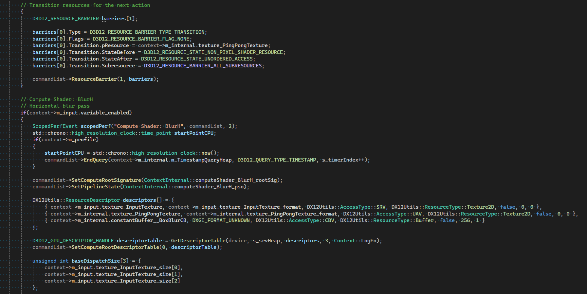

# Gigi

Gigi is software designed for rapid prototyping and development of real time rendering techniques. It is meant for use by professionals, researchers, students, and hobbyists.

The goal is to allow work at the speed of thought, and then easily use what was created in real applications using various APIs or engines.

[See what people say about using Gigi](readme/testimonials.md)

Gigi is made of four components:

1. Editor - Author a rendering technique
2. Viewer - Debug and profile the technique
3. Compiler - Generate code for the technique like a human would write
4. Browser - View a library of Gigi techniques, and submit your own

[Click here to read more about these components](readme/Overview.md)

Gigi Editor | Gigi Viewer
:-----:|:------:|
 | 

Gigi Compiler Generated Code (DX12) | Gigi Browser
:-----:|:------:|
 | 

Gigi is being actively used and developed, but is young software. You may hit bugs or missing features. Please report these so we can improve Gigi and push forward in the most useful directions. Pull requests are also appreciated! Please see the "Contributing" section below.

Currently, only dx12 code generation is available in this public version of Gigi, but we are hoping to support other APIs, and engines as well, in the future.

# Building or Getting, and Running

Cloning this repo and then building gigi.sln is all that is needed to build Gigi.

To use prebuilt binaries, go to the releases tab https://github.com/electronicarts/gigi/releases/.  You can either download the .zip file, and extract that to the location of your choice, or you can download and run the installer exe.

There will be four executables in the root folder:

* **GigiEdit** - This is the editor.
* **GigiViewerDX12** - This is the viewer. 
* **GigiCompiler** - This is the command line interface compiler.
* **GigiBrowser** - This lets you browse, download, and open techniques from the technique library.

# Learning & Support

Introductory Gigi Tutorial: Make a box blur post processing effect.
* [Text Version](readme/tutorial/tutorial.md)
* [25 minute Video](https://www.youtube.com/watch?v=qknK-tahICE)

[Discord: Gigi Rapid Graphics Development](https://discord.gg/HPzqAw2H3k)

[Gigi Jam 2024 Lightning Talks (YouTube)](https://www.youtube.com/watch?v=m62ePwK33PM)

[Gigi Technical Overview (YouTube GPC 2024)](https://www.youtube.com/watch?v=MgCR-Kky628)

The browser lets you explore some examples to help get you started.  The **Techniques/UnitTests/** folder contains the unit tests, which aims to exercise every possible piece of functionality.

There are also documents in the **UserDocumentation** folder that explain the viewer python interface, Gigi shader tokens, and other things.

# Reporting Bugs & Making Feature Requests

For reporting bugs or making feature requests, create a new issue in this repo.

For bug reports, giving or linking to a zip file of a gigi technique and related files which reproduces the bug is helpful.  The more minimal the technique, the faster we can fix the problem.  Please also provide steps to see the problem, and how what happens differs from what you expect to happen.

For feature requests, the more information you give us about your need, the better we can come up with something to address the need.  We may not always give you what you want as you describe it, but we will aim to solve the spirit of what you are asking for, considering any other constraints that may be in play.

If you could also let us know the urgency of the bug or missing feature on your side, that will help us triage the work.  We can't promise to have an immediate resolution to your report, but we will do what we can, as soon as we can.

# Sharing Techniques In The Gigi Browser

See this document for more information: [Sharing Techniques In The Gigi Browser](readme/BrowserSharing.md)

# Contributors

Created by Alan Wolfe

**Contributors:**

Adam Badke

Alexey Gladkov

Berk Emre Saribas

Chris Lewin

Ivar Jönsson

Jan Werbrouck

Martin Mittring

Mohit Sethi

Patrick Anderson

Richard Raquepo

Stephane Levesque

Tristan Calderbank

[Gigi would not be possible without several open sourced libraries](readme/OSS.md)

# Contributing

Before you can contribute, EA must have a Contributor License Agreement (CLA) on file that has been signed by each contributor.
You can sign here: http://bit.ly/electronic-arts-cla

Any contribution - large or small - is much appreciated and earns you a spot on the contributors list. Just add your name to the list (alpha sorted) as part of your pull request!

As far as coding standards, we need to write them up and automate them as much as we can, but for now, try to make your code look like other code.

With each pull request, besides testing any functionality you are touching, please also verify that both the viewer and dx12 unit tests are still passing, and consider adding unit tests if appropriate.

To run the viewer unit tests, from inside the viewer select File->Run Python Script and choose **Techniques/UnitTests/RunTests.py**.  It should report that it has zero errors.

To run the DX12 unit tests, first run the **MakeCode_UnitTests_DX12.bat** file to generate the code for the unit tests.  If this results in no diffs, you can consider it a success.  To actually run the generated tests, open and run **_GeneratedCode/UnitTests/DX12/UnitTests.sln**.  It should report that it has zero errors.

#

 
<b>Search for Extraordinary Experiences Division (SEED) - Electronic Arts   http://seed.ea.com</b> 
We are a cross-disciplinary team within EA Worldwide Studios. 
Our mission is to explore, build and help define the future of interactive entertainment.

