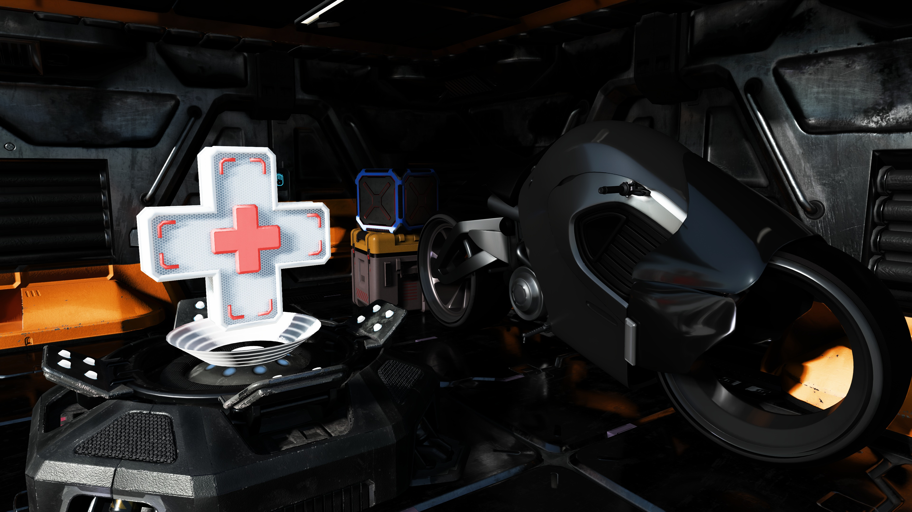
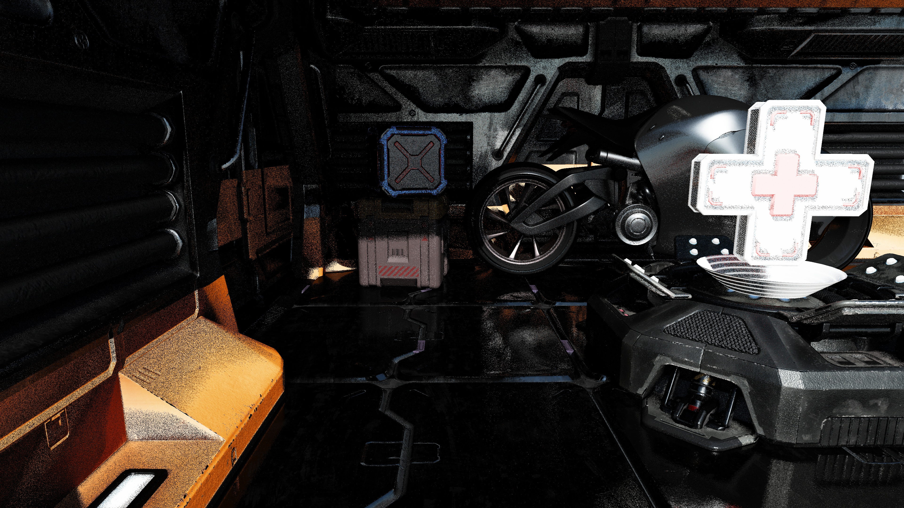
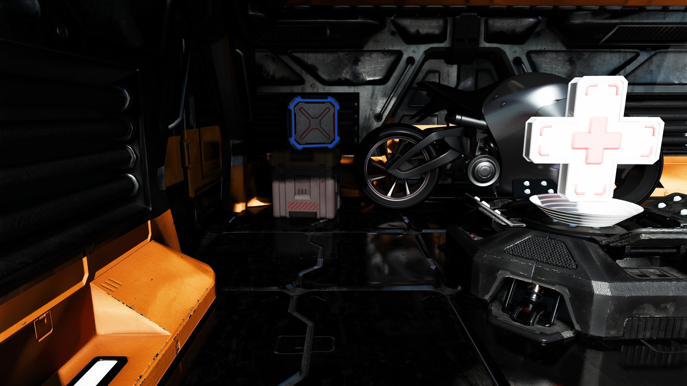
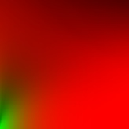

<!-- @page page_techniques_denoising FSR™ Ray Regeneration 1.0.0 Denoiser -->

# FSR™ Ray Regeneration 1.0.0

<p align="center">
  
</p>
<p align="center">
  <b>Figure 1</b>: <i>Sample output from FSR™ Ray Regeneration.</i>
</p>

FSR™ Ray Regeneration is a machine learning-based denoiser for ray-traced workloads.
It improves visual quality by reducing noise in rendered frames while preserving detail.

## Table of contents

- [Introduction](#introduction)
  - [Decoupled denoising vs. joint denoising](#decoupled-denoising-vs-joint-denoising)
  - [Denoising modes](#denoising-modes)
- [Getting started](#getting-started)
  - [Setting up your project](#setting-up-your-project)
  - [Querying support](#querying-support)
  - [Creating the context](#creating-the-context)
  - [Dispatching](#dispatching)
  - [Configuring settings](#configuring-settings)
  - [Querying the currently used version](#querying-the-currently-used-version)
  - [Cleaning up](#cleaning-up)
- [Performance](#performance)
  - [Memory requirements](#memory-requirements)
- [Best practices](#best-practices)
  - [Generating noisy signals](#generating-noisy-signals)
  - [Providing motion vectors](#providing-motion-vectors)
  - [Encoding normals](#encoding-normals)
  - [Encoding material type](#encoding-material-type)
  - [Generating specular albedo](#generating-specular-albedo)
- [Requirements](#requirements)
  - [Hardware](#hardware)
  - [Shading language](#shading-language)
- [Version history](#version-history)
- [References](#references)
- [See also](#see-also)

## Introduction

Since the advent of hardware-accelerated ray tracing, real-time game and rendering engines have increasingly adopted ray tracing techniques.
From realistic reflections to finely detailed shadows, ray tracing has significantly elevated visual fidelity in modern games.
As GPU ray tracing capabilities continue to improve, developers are pushing the boundaries of global illumination and exploring real-time path tracing.
However, raw ray-traced outputs are inherently noisy, making effective denoising essential for producing clean, high-quality images.

Denoising transforms noisy ray- or path-traced outputs into coherent, visually accurate images, often leveraging both spatial and temporal information.
FSR™ Ray Regeneration performs this task with a key advantage: it uses machine learning to dynamically determine optimal filter weights, delivering superior results compared to purely analytical methods.

### Decoupled denoising vs. joint denoising

FSR™ Ray Regeneration performs denoising independently of upscaling, making it a decoupled denoiser.
In contrast, denoising and upscaling can also be combined into a single, joint operation.
Both approaches are valid, but decoupling denoising into its own dispatch call simplifies adding additional rendered content afterward.

Although upscaling is not strictly required for denoising, rendering expensive ray-traced effects, especially path tracing, at native resolution can be very demanding on hardware.
With significant advancements in upscaling technology, incorporating upscaling into the rendering pipeline is strongly recommended.
Additionally, the temporal anti-aliasing provided by upscalers such as FSR™ 4 adds an extra layer of smoothing when used alongside FSR™ Ray Regeneration.
For optimal visual results, FSR™ Ray Regeneration should be paired with FSR™ 4.

### Denoising modes

To maximize compatibility and efficiency when denoising your game's specific workloads, FSR™ Ray Regeneration provides multiple input/output configurations:

| Configuration                                                               | Inputs                                                               |
|-----------------------------------------------------------------------------|----------------------------------------------------------------------|
| [`FFX_DENOISER_MODE_4_SIGNALS`](../../denoisers/include/ffx_denoiser.h#L46) | Direct specular, direct diffuse, indirect specular, indirect diffuse |
| [`FFX_DENOISER_MODE_2_SIGNALS`](../../denoisers/include/ffx_denoiser.h#L47) | Fused specular and diffuse                                           |
| [`FFX_DENOISER_MODE_1_SIGNAL`](../../denoisers/include/ffx_denoiser.h#L48)  | Fused specular and diffuse into one signal                           |

The selected mode is specified via the [`mode`](../../denoisers/include/ffx_denoiser.h#L58) member of the [`ffxCreateContextDescDenoiser`](../../denoisers/include/ffx_denoiser.h#L52) context creation description.

Additionally, you can denoise the dominant light visibility as a separate signal by adding the [`FFX_DENOISER_ENABLE_DOMINANT_LIGHT`](../../denoisers/include/ffx_denoiser.h#L41) to the [`flags`](../../denoisers/include/ffx_denoiser.h#L59) member of the [`ffxCreateContextDescDenoiser`](../../denoisers/include/ffx_denoiser.h#L52) context creation description.

## Getting started

### Setting up your project

FSR™ Ray Regeneration is part of the FSR™ SDK.
Before getting started, make sure to read the [Getting Started with the FSR™ API](../getting-started/ffx-api.md) guide.
Once familiar with the API, follow these steps to prepare your project for FSR™ Ray Regeneration:

1. Add the [FSR™ API include headers](../../api/include/) to your project’s include directories.
2. Add the [FSR™ Ray Regeneration headers](../../denoisers/include/) to your project’s include directories.
3. Link your project against `amd_fidelityfx_loader_dx12.lib`, located in [FidelityFX/signedbin](../../signedbin).
4. Copy `amd_fidelityfx_loader_dx12.dll` and `amd_fidelityfx_denoiser_dx12.dll` from [FidelityFX/signedbin](../../signedbin) into your project’s executable directory.

### Querying support

Before creating a context, you can check for support by using the [`ffxQuery`](../../api/include/ffx_api.h#L151) API to enumerate the available contexts.
If the query returns no contexts, support for FSR™ Ray Regeneration is not available.

The FSR™ Ray Regeneration sample demonstrates how to query and handle the available contexts:

```cpp
uint64_t DenoiserVersionCount = 0;
ffx::QueryDescGetVersions queryVersionsDesc = {};
queryVersionsDesc.createDescType = FFX_API_EFFECT_ID_DENOISER;
queryVersionsDesc.device = m_device;
queryVersionsDesc.outputCount = &DenoiserVersionCount;
ffx::Query(queryVersionsDesc);

m_DenoiserVersionIds.resize(DenoiserVersionCount);
m_DenoiserVersionStrings.resize(DenoiserVersionCount);

queryVersionsDesc.versionIds = m_DenoiserVersionIds.data();
queryVersionsDesc.versionNames = m_DenoiserVersionStrings.data();
ffx::Query(queryVersionsDesc);

m_DenoiserAvailable = !m_DenoiserVersionIds.empty();
```

### Creating the context

To start using FSR™ Ray Regeneration, you need to create a denoiser context.
This requires filling out an [`ffxCreateContextDescDenoiser`](../../denoisers/include/ffx_denoiser.h#L52) struct along with a backend description.
Then, pass these structs to [`ffxCreateContext`](../../api/include/ffx_api.h#L133).
The parameters you provide determine the internal resource allocations and pipeline state compilations.
Creating contexts in time-critical paths is not recommended due to their initialization cost.
If the hardware does not support FSR™ Ray Regeneration, [`ffxCreateContext`](../../api/include/ffx_api.h#L133) will return an error and the context pointer will remain unset.

```cpp
ffx::CreateBackendDX12Desc dx12BackendDesc = {};
dx12BackendDesc.device = GetDevice()->GetImpl()->DX12Device();

ffx::CreateContextDescDenoiser denoiserContextDesc = {};
denoiserContextDesc.version = FFX_DENOISER_VERSION;
denoiserContextDesc.maxRenderSize = { resInfo.UpscaleWidth, resInfo.UpscaleHeight };
denoiserContextDesc.mode = m_DenoiserMode;

// Optional flags
if (m_EnableDebugging)
    denoiserContextDesc.flags |= FFX_DENOISER_ENABLE_DEBUGGING;
if (m_EnableDominantLightVisibilityDenoising)
    denoiserContextDesc.flags |= FFX_DENOISER_ENABLE_DOMINANT_LIGHT;

// Create the denoiser context
ffx::CreateContext(m_pDenoiserContext, nullptr, denoiserContextDesc, dx12BackendDesc);
```

For use cases that require a specific context version, you can override it by passing an optional [`ffxOverrideVersion`](../../api/include/ffx_api.h#L100) description to [`ffxCreateContext`](../../api/include/ffx_api.h#L133).

```cpp
ffx::CreateContextDescOverrideVersion versionOverride = {};
versionOverride.versionId = m_DenoiserVersionIds[m_SelectedDenoiserVersion];

// Create the denoiser context
ffx::CreateContext(m_pDenoiserContext, nullptr, denoiserContextDesc, dx12BackendDesc, versionOverride);
```

### Dispatching

Denoising is performed on the GPU using [`ffxDispatch`](../../api/include/ffx_api.h#L156).
This function takes a [`ffxDispatchDescDenoiser`](../../denoisers/include/ffx_denoiser.h#L89) struct along with input/output structs for the signals.
The templated [`ffx_api.hpp`](../../api/include/ffx_api.hpp) allows chaining multiple inputs together as variable arguments.
This enables concise calls for different signal configurations.

#### Example: 4 signals + dominant light

```cpp
// Denoise 4 signals + dominant light
ffx::DispatchDescDenoiser dispatchDenoiser = {};
ffx::DispatchDescDenoiserInput4Signals dispatchDenoiserInputs = {};
ffx::DispatchDescDenoiserInputDominantLight dispatchDenoiserInputsDominantLight = {};

// Fill in the structs with the appropriate data:
// ...

ffx::Dispatch(m_pDenoiserContext, dispatchDenoiser, dispatchDenoiserInputs, dispatchDenoiserInputsDominantLight);
```

#### Example: 2 signals + dominant light

```cpp
// Denoise 2 signals + dominant light
ffx::DispatchDescDenoiser dispatchDenoiser = {};
ffx::DispatchDescDenoiserInput2Signals dispatchDenoiserInputs = {};
ffx::DispatchDescDenoiserInputDominantLight dispatchDenoiserInputsDominantLight = {};

// Fill in the structs with the appropriate data:
// ...

ffx::Dispatch(m_pDenoiserContext, dispatchDenoiser, dispatchDenoiserInputs, dispatchDenoiserInputsDominantLight);
```

#### Example: 1 fused signal

```cpp
// Denoise just 1 fused signal
ffx::DispatchDescDenoiser dispatchDenoiser = {};
ffx::DispatchDescDenoiserInput1Signal dispatchDenoiserInputs = {};

// Fill in the structs with the appropriate data:
// ...

ffx::Dispatch(m_pDenoiserContext, dispatchDenoiser, dispatchDenoiserInputs);
```

The dispatch call requires additional parameters that provide per-frame information and resources.
These are mandatory for accurate temporal and spatial denoising.

| Parameter                                                               | Description |
|-------------------------------------------------------------------------|-------------|
| [`linearDepth`](../../denoisers/include/ffx_denoiser.h#L94)             | Resource containing linear depth values for the current frame.<br><br>Preferred format: `R32_FLOAT` |
| [`motionVectors`](../../denoisers/include/ffx_denoiser.h#L95)           | Resource containing motion vectors for the current frame.<br><br>Preferred format: `RGBA16_FLOAT`<br>`RG`: pixel movement in 2D<br>`B`: linear depth delta |
| [`normals`](../../denoisers/include/ffx_denoiser.h#L96)                 | Resource containing normals and roughness for the current frame.<br><br>Preferred format: `RGB10A2_UNORM`<br>`RG`: octahedrally encoded normals (see [Encoding normals](#encoding-normals))<br>`B`: linear roughness<br>`A`: material type (see [Encoding material type](#encoding-material-type)) |
| [`specularAlbedo`](../../denoisers/include/ffx_denoiser.h#L97)          | Resource containing specular albedo for the current frame (see [Generating specular albedo](#generating-specular-albedo)).<br>If [`FFX_DENOISER_DISPATCH_NON_GAMMA_ALBEDO`](../../denoisers/include/ffx_denoiser.h#L65) is not added to [`flags`](../../denoisers/include/ffx_denoiser.h#L116), all channels are expected to be encoded using `sqrt`.<br><br>Preferred format: `RGBA8_UNORM`<br>`RGB`: specular albedo<br>`A`: dot(N, V) |
| [`diffuseAlbedo`](../../denoisers/include/ffx_denoiser.h#L98)           | Resource containing diffuse albedo for the current frame.<br>If [`FFX_DENOISER_DISPATCH_NON_GAMMA_ALBEDO`](../../denoisers/include/ffx_denoiser.h#L65) is not added to [`flags`](../../denoisers/include/ffx_denoiser.h#L116), all channels are expected to be encoded using `sqrt`.<br><br>Preferred format: `RGBA8_UNORM`<br>`RGB`: diffuse albedo<br>`A`: metalness |
| [`motionVectorScale`](../../denoisers/include/ffx_denoiser.h#L100)      | Scale factor applied to the 2D motion vectors to convert them into UV-space (see [Encoding normals](#encoding-normals)). |
| [`jitterOffsets`](../../denoisers/include/ffx_denoiser.h#L101)          | Subpixel jitter offsets applied to the camera projection. |
| [`cameraPositionDelta`](../../denoisers/include/ffx_denoiser.h#L103)    | Camera movement since last frame (`PreviousPosition - CurrentPosition`). |
| [`cameraRight`](../../denoisers/include/ffx_denoiser.h#L104)            | Right vector of the camera, expressed in world space. |
| [`cameraUp`](../../denoisers/include/ffx_denoiser.h#L105)               | Up vector of the camera, expressed in world space. |
| [`cameraForward`](../../denoisers/include/ffx_denoiser.h#L106)          | Forward vector of the camera, expressed in world space. |
| [`cameraAspectRatio`](../../denoisers/include/ffx_denoiser.h#L107)      | Aspect ratio of the camera. |
| [`cameraNear`](../../denoisers/include/ffx_denoiser.h#L108)             | Distance to the near plane of the camera. |
| [`cameraFar`](../../denoisers/include/ffx_denoiser.h#L109)              | Distance to the far plane of the camera. |
| [`cameraFovAngleVertical`](../../denoisers/include/ffx_denoiser.h#L110) | Vertical field of view of the camera, expressed in radians. |
| [`renderSize`](../../denoisers/include/ffx_denoiser.h#L112)             | Resolution used for rendering the current frame input resources. |
| [`deltaTime`](../../denoisers/include/ffx_denoiser.h#L113)              | Time elapsed since the last frame, expressed in milliseconds. |
| [`frameIndex`](../../denoisers/include/ffx_denoiser.h#L114)             | Index of the current frame. |
| [`flags`](../../denoisers/include/ffx_denoiser.h#L116)                  | Zero or a combination of values from [`FfxApiDispatchDenoiserFlags`](../../denoisers/include/ffx_denoiser.h#L62). |

### Configuring settings

To achieve the best results with FSR™ Ray Regeneration, some settings may need to be adjusted.
The default values are already set to sensible presets and are not simply zeros.
A recommended best practice when modifying settings is to first query the current defaults via the API.
This ensures that you start from a valid baseline.

Example code:

```cpp
ffx::QueryDescDenoiserGetDefaultSettings queryDefaultSettingsDesc = {};
queryDefaultSettingsDesc.device = m_Device;
queryDefaultSettingsDesc.defaultSettings = &m_Settings;

ffx::Query(queryDefaultSettingsDesc);
```

New denoiser settings can be committed at any time **before** calling [`ffxDispatch`](../../api/include/ffx_api.h#L156) and do **not** need to be updated every frame.

To apply the settings, use [`ffxConfigure`](../../api/include/ffx_api.h#L145) with the [`FfxApiDenoiserSettings`](../../denoisers/include/ffx_denoiser.h#L76) struct:

```cpp
ffx::ConfigureDescDenoiserSettings settings = {};
settings.settings = m_DenoiserSettings;

ffx::Configure(m_pDenoiserContext, settings);
```

### Querying the currently used version

The denoiser context in FSR™ Ray Regeneration follows the same design pattern as FSR™ Upscaling and FSR™ Frame Generation.
This means a driver override may be present, so the actual context version might differ from the version defined in the header as [`FFX_DENOISER_VERSION`](../../denoisers/include/ffx_denoiser.h#L32).

To determine the actual version of the context, use the following [`ffxQuery`](../../api/include/ffx_api.h#L151) function:

```cpp
uint32_t versionMajor = 0;
uint32_t versionMinor = 0;
uint32_t versionPatch = 0;

ffx::QueryDescDenoiserGetVersion versionQuery = {};
versionQuery.device = m_device;
versionQuery.major = &versionMajor;
versionQuery.minor = &versionMinor;
versionQuery.patch = &versionPatch;

ffx::Query(m_pDenoiserContext, versionQuery);
```

### Cleaning up

The application is responsible for cleaning up any created denoiser context.
This is done by calling [`ffxDestroyContext`](../../api/include/ffx_api.h#L139) with the context to be destroyed.

> [!CAUTION]
> Ensure the GPU has finished any work that might reference resources used by the context before calling [`ffxDestroyContext`](../../api/include/ffx_api.h#L139).
> Failing to do so can lead to undefined behavior.

## Performance

FSR™ Ray Regeneration performance may vary depending on your target hardware and configuration.

#### Denoising 4 signals + dominant light signal:

| Target Render Resolution | Milliseconds (ms) |
|-------------------------:|------------------:|
| 960x540                  | 1.7               |
| 1920x1080                | 4.0               |
| 2560x1440                | 7.9               |

#### Denoising 2 signals + dominant light signal:

| Target Render Resolution | Milliseconds (ms) |
|-------------------------:|------------------:|
| 960x540                  | 1.3               |
| 1920x1080                | 3.2               |
| 2560x1440                | 6.4               |

#### Denoising 1 signal:

| Target Render Resolution | Milliseconds (ms) |
|-------------------------:|------------------:|
| 960x540                  | 1.1               |
| 1920x1080                | 2.3               |
| 2560x1440                | 4.9               |

Performance figures are accurate at the time of writing for an AMD Radeon™ RX 9070 XT and are subject to change.

### Memory requirements

FSR™ Ray Regeneration requires additional GPU local memory for use by the GPU.
When using the API, this memory is allocated during context creation via the series of callbacks that make up the backend interface.
This memory is used to store intermediate surfaces computed by the algorithm, as well as surfaces that persist across multiple frames of the application.

The tables below summarize the memory usage of FSR™ Ray Regeneration under various operating conditions.

> [!NOTE]
> Only the persistent memory needs to be included in the total frame memory budget.
> The aliasable working set can be repurposed before and after the [`ffxDispatch`](../../api/include/ffx_api.h#L156) call.

#### Denoising 4 signals + dominant light signal:

| Render Resolution | Total Working Set | Persistent Working Set | Aliasable Working Set |
| -----------------:|------------------:|-----------------------:|----------------------:|
|   960x540         |  141 MB           |   41 MB                |  100 MB               |
| 1920x1080         |  498 MB           |  141 MB                |  357 MB               |
| 2560x1440         |  858 MB           |  250 MB                |  608 MB               |

#### Denoising 2 signals + dominant light signal:

| Render Resolution | Total Working Set | Persistent Working Set | Aliasable Working Set |
| -----------------:|------------------:|-----------------------:|----------------------:|
|   960x540         |  114 MB           |   32 MB                |   82 MB               |
| 1920x1080         |  403 MB           |  109 MB                |  294 MB               |
| 2560x1440         |  686 MB           |  192 MB                |  494 MB               |

#### Denoising 1 signal:

| Render Resolution | Total Working Set | Persistent Working Set | Aliasable Working Set |
| -----------------:|------------------:|-----------------------:|----------------------:|
|   960x540         |   87 MB           |   23 MB                |   64 MB               |
| 1920x1080         |  307 MB           |   77 MB                |  230 MB               |
| 2560x1440         |  514 MB           |  135 MB                |  379 MB               |

Memory figures are accurate at the time of writing for an AMD Radeon™ RX 9070 XT and are subject to change.

An application can query the amount of GPU local memory required by FSR™ Ray Regeneration **before** creating a denoiser context.
See code examples for calling [ffxQuery](../getting-started/ffx-api.md#Query):

```cpp
FfxApiEffectMemoryUsage memory = {};
ffx::QueryDescDenoiserGetGPUMemoryUsage queryMemoryDesc = {};
queryMemoryDesc.device = m_device;
queryMemoryDesc.maxRenderSize = denoiserContextDesc.maxRenderSize;
queryMemoryDesc.mode = denoiserContextDesc.mode;
queryMemoryDesc.flags = denoiserContextDesc.flags;
queryMemoryDesc.gpuMemoryUsage = &memory;

ffx::Query(queryMemoryDesc, versionOverride);

LOG(L"Denoiser GPU Memory Usage totalUsageInBytes %.3f MB aliasableUsageInBytes %.3f MB",
    memory.totalUsageInBytes     / 1048576.f,
    memory.aliasableUsageInBytes / 1048576.f);
```

## Best practices

### Generating noisy signals

FSR™ Ray Regeneration, depending on the selected mode, expects one or more low-sample input radiance signals for denoising.
High-quality inputs are essential to achieve the best results, as the algorithm is not designed to "correct" artefacts present in the input data.
Below are some guidelines for generating high-quality noisy inputs.

#### Stochastic sampling

In most physically-based path tracers, stochastic sampling is used to simulate realistic lighting behaviors such as shadows, reflections, and indirect lighting.
Stochastic sampling introduces randomness into ray directions so that, over many samples, the result converges to a noise-free signal.
At low sample counts, this randomness produces perceivable noise in the rendered image.
This noise is exactly what FSR™ Ray Regeneration targets for denoising.
Understanding and managing the quality of this noise is critical for achieving optimal denoising results.

<table style="width:100%; table-layout:fixed;">
  <tr>
    <th style="width:50%; text-align:center;">Noisy Input</th>
    <th style="width:50%; text-align:center;">Denoised Output</th>
  </tr>
  <tr>
    <td style="text-align:center;">
      
    </td>
    <td style="text-align:center;">
      
    </td>
  </tr>
</table>
<p align="center">
  <b>Figure 2</b>: <i>left: Noisy ray-traced input to FSR™ Ray Regeneration. right: Corresponding denoised output from FSR™ Ray Regeneration.</i>
</p>

#### Noise

We recommend using white noise and high-quality hash functions with minimal correlations when driving stochastic sampling.
Examples of suitable hash functions include [`xxhash32`](https://xxhash.com/) and [`lowbias32`](https://nullprogram.com/blog/2018/07/31/).

A good practice is to ensure that your ray-traced image converges to a noise-free result when using many samples without denoising.
If it does not, verify whether your chosen noise or hash function is introducing unwanted correlations or other artifacts that are difficult to denoise.

While blue noise often performs well in many scenarios, it can introduce correlation artifacts if its period is not sufficiently large.
For this reason, white noise is generally preferred for FSR™ Ray Regeneration inputs.

Noise reduction techniques such as ReSTIR can help reduce noise in the input signals.
However, these techniques often introduce cross-sample dependencies that FSR™ Ray Regeneration is not designed to handle.
In such cases, it is important to disrupt correlation patterns using strategies like permutation sampling or randomization of temporal reuse.

#### Usage of radiance caching

Tracing paths recursively quickly becomes too expensive for real-time rendering.
To manage this cost, many real-time path tracers apply radiance caching after only a few recursive bounces.
Radiance caching provides a precomputed store of radiance that can be sampled by direction, enabling early ray termination and significantly reducing computational overhead.

Using a radiance cache generally results in a more complete signal, since additional lighting contributions, too expensive to compute per frame, are incorporated through cached samples.
This is naturally beneficial for FSR™ Ray Regeneration, as more complete inputs typically yield more complete and stable outputs.

However, the caching process often trades accuracy for performance, which may introduce artifacts into the final image.
Watch out for low-frequency noise or temporal inconsistencies, as these issues can be amplified by the denoiser if not mitigated.

> [!TIP]
> Keep an option to disable radiance caching in your path tracer.
> This can be invaluable when debugging denoiser artifacts.

See [AMD GI-1.0](https://gpuopen.com/download/GPUOpen2022_GI1_0.pdf) for examples and guidance on radiance caching.

#### Tweakable denoiser settings

Even with high-quality inputs and the recommended best practices applied, some artifacts may still remain.
FSR™ Ray Regeneration exposes a number of tweakable settings, defined in [`FfxApiDenoiserSettings`](../../denoisers/include/ffx_denoiser.h#L76), that allow fine-grained control over denoiser behavior.
These parameters can help balance stability, sharpness, and noise reduction to best suit your application.

It is recommended to start from the default settings queried from the API and then adjust selectively according to what works best for your application.
For guidance on retrieving and applying these settings, see [Configuring settings](#configuring-settings).

### Providing motion vectors

#### Space

A key part of any temporal algorithm is the provision of motion vectors.

FSR™ Ray Regeneration accepts motion vectors in a 2.5D format:
- The `XY` components represent screen-space pixel motion, encoding the movement from a pixel in the current frame to the same pixel in the previous frame.
- The `Z` component represents the linear view-space `z` delta.

<p align="center">
  
</p>
<p align="center">
  <b>Figure 3</b>: <i>A 2D motion vector from a pixel in the current frame to the corresponding pixel in the previous frame.</i>
</p>

If your application computes motion vectors in a space other than UV space (for example, NDC space), you can use the [`motionVectorScale`](../../denoisers/include/ffx_denoiser.h#L100) member of the [`ffxDispatchDescDenoiser`](../../denoisers/include/ffx_denoiser.h#L89) dispatch description to scale them appropriately for FSR™ Ray Regeneration.

Example HLSL and C++ code illustrating NDC-space motion vector scaling:

```hlsl
// GPU: Example of NDC motion vector computation
float2 motionVector = (previousPosition.xy / previousPosition.w) - (currentPosition.xy / currentPosition.w);
```
```cpp
// CPU: Matching FSR™ Ray Regeneration motionVectorScale configuration to convert motion vectors from NDC to UV space
dispatchParameters.motionVectorScale.x = 0.5f;
dispatchParameters.motionVectorScale.y = -0.5f;
```

#### Coverage

FSR™ Ray Regeneration achieves higher-quality denoising when more objects provide valid motion vectors.
It is therefore recommended that all opaque, alpha-tested, and alpha-blended objects write motion vectors for every pixel they cover.
Additionally, if vertex shader effects are applied, such as scrolling UVs or procedural vertex animations, these transformations should also be incorporated into the motion vector computation to ensure optimal results.

### Encoding normals

Each 3D normal vector represents a direction on the unit sphere.
To store normals efficiently, we can project the unit sphere onto a 2D plane and remap each normal vector as a 2D UV coordinate.
This process is called [octahedral encoding](https://onlinelibrary.wiley.com/doi/10.1111/j.1467-8659.2010.01737.x).
The normals passed to FSR™ Ray Regeneration are required to be stored using octahedral encoding.

Below are examples of how to encode and decode normals using this method.

#### Octahedral encoding of normals:

```hlsl
float2 NormalToOctahedronUv(float3 N)
{
    N.xy /= abs(N.x) + abs(N.y) + abs(N.z);
    float2 k = sign(N.xy);
    float s = saturate(-N.z);
    N.xy = lerp(N.xy, (1.0 - abs(N.yx)) * k, s);
    return N.xy * 0.5 + 0.5;
}
```

#### Octahedral decoding of normals:

```hlsl
float3 OctahedronUvToNormal(float2 UV)
{
    UV = UV * 2.0f - 1.0f;
    float3 N = float3(UV, 1.0f - abs(UV.x) - abs(UV.y));
    float t = saturate(-N.z);
    float2 s = sign(N.xy);
    N.xy += s * t;
    return normalize(N);
}
```

### Encoding material type

The alpha channel of the [`normals`](../../denoisers/include/ffx_denoiser.h#L96) member of the [`ffxDispatchDescDenoiser`](../../denoisers/include/ffx_denoiser.h#L89) dispatch description is used to encode the material type.
The material type is a lightweight way to distinguish different surface materials from one another.
FSR™ Ray Regeneration will reject mixing between two pixels if their material IDs do **not** match.
This prevents cross-material blending and is an effective solution for avoiding ghosting artifacts in complex material setups.

FSR™ Ray Regeneration supports three material type variations.
Material type `0` is reserved as the _default_ material.
Upon encoding the material type into the [`normals`](../../denoisers/include/ffx_denoiser.h#L96) member of the [`ffxDispatchDescDenoiser`](../../denoisers/include/ffx_denoiser.h#L89) input, the stored value should be a normalized fraction relative to the maximum number of supported materials.

```hlsl
// ... ray tracing pass ...

uint materialType = hit.materialType;
float materialTypeFrac = materialType / 3.0;

outNormalsResource[pixel] = float4(normalOctahedralUv, roughness, materialTypeFrac);

```

> [!TIP]
> New integrations should start by using material type `0` for all pixels.
> Then gradually add additional material types only for cases that exhibit visible artifacts when mixed with other materials.

### Generating specular albedo

Specular albedo can be generated using various methods.
In most physically-based rendering pipelines, similar computations are already performed as part of the lighting computations.
These computations can be reused to generate a standalone specular albedo feature map.

Below are two commonly used methods for generating specular albedo in real-time rendering applications.

#### Example: BRDF lookup table

A BRDF LUT is generated offline and stored in a floating-point texture.
At runtime, this LUT is sampled to look up approximate BRDF characteristics, commonly used in the [split-sum approximation for image-based lighting](https://blog.selfshadow.com/publications/s2013-shading-course/karis/s2013_pbs_epic_notes_v2.pdf).

<p align="center">
  
</p>
<p align="center">
  <b>Figure 4</b>: <i>A typical GGX BRDF look-up table.</i>
</p>

The following HLSL code snippet illustrates how to sample the BRDF LUT and use the resulting scale and bias to generate specular albedo:

```hlsl
// ... ray tracing pass ...

float NoV = dot(normal, view);
float2 brdf = BrdfLUT.SampleLevel(LinearSampler, float2(NoV, hit.materialRoughness), 0);

const float3 MinReflectance = float3(0.04, 0.04, 0.04);
float3 F0 = lerp(MinReflectance, hit.materialAlbedo.rgb, hit.materialMetallic);
float3 specularAlbedo = F0 * brdf.x + brdf.y;

// ...
```

#### Example: BRDF Approximation

The following HLSL code snippets illustrate how to approximate the BRDF influence at runtime without the need for an offline baked LUT:

```hlsl
// [Ray Tracing Gems, Chapter 32]
float3 ApproximateBRDF(float3 F0, float alpha, float NoV)
{
    NoV = abs(NoV);
    float4 x = float4(1.0, NoV, NoV*NoV, NoV*NoV*NoV);
    float4 y = float4(1.0, alpha, alpha*alpha, alpha*alpha*alpha);

    float2x2 M1 = float2x2(0.99044, -1.28514, 
                           1.29678, -0.755907);

    float3x3 M2 = float3x3(1.0,      2.92338, 59.4188, 
                           20.3225, -27.0302, 222.592, 
                           121.563,  626.13,  316.627);

    float2x2 M3 = float2x2(0.0365463, 3.32707, 
                           9.0632,   -9.04756);

    float3x3 M4 = float3x3(1.0,      3.59685, -1.36772, 
                           9.04401, -16.3174,  9.22949, 
                           5.56589,  19.7886, -20.2123);

    float bias = dot(mul(M1, x.xy), y.xy) * rcp(dot(mul(M2, x.xyw), y.xyw));
    float scale = dot(mul(M3, x.xy), y.xy) * rcp(dot(mul(M4, x.xzw), y.xyw));

    // Hack for specular reflectance of 0
    bias *= saturate(F0.g * 50);
    return mad(F0, max(0, scale), max(0, bias));
}

// ... ray tracing pass ...

const float3 MinReflectance = float3(0.04, 0.04, 0.04);
float3 F0 = lerp(MinReflectance, hit.materialAlbedo.rgb, hit.materialMetallic);

float alpha = hit.materialRoughness * hit.materialRoughness;
float NoV = dot(normal, view);

float3 specularAlbedo = ApproximateBRDF(F0, alpha, NoV);

// ...
```

## Requirements

### Hardware

- FSR™ Ray Regeneration requires an AMD Radeon™ RX 9000 Series GPU or later.

### Shading language

- Shader Model 6.6

## Version history

| Version   | Date            |
|-----------|-----------------|
| **1.0.0** | Initial release |

For more details, refer to the changelog.

## References

## See also

- [FSR™ API](../getting-started/ffx-api.md)
- [FSR™ Upscaling](../samples/super-resolution.md)
- [FSR™ Naming guidelines](../getting-started/naming-guidelines.md)
