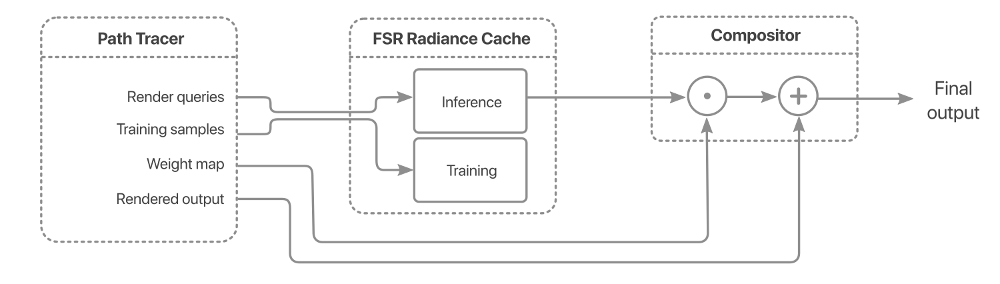
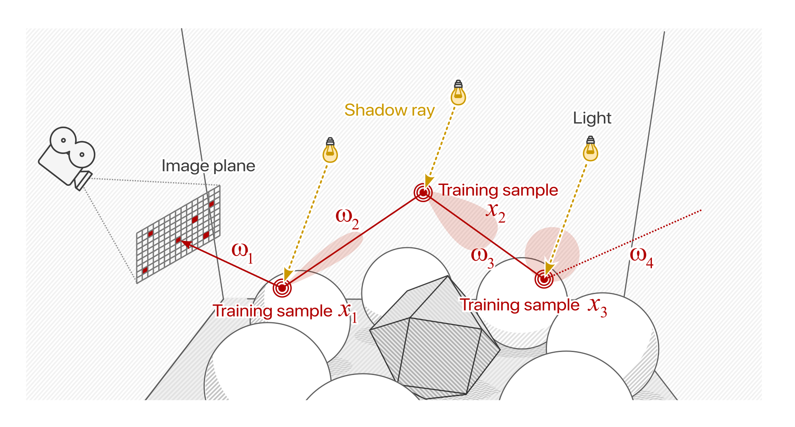
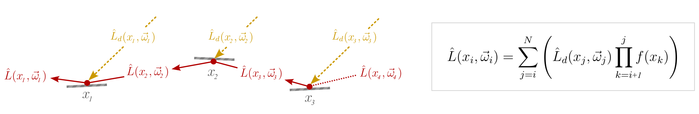
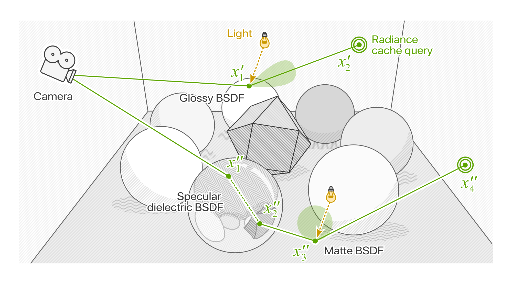
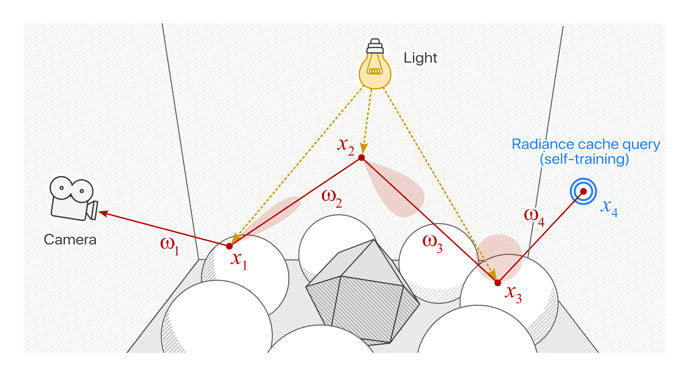
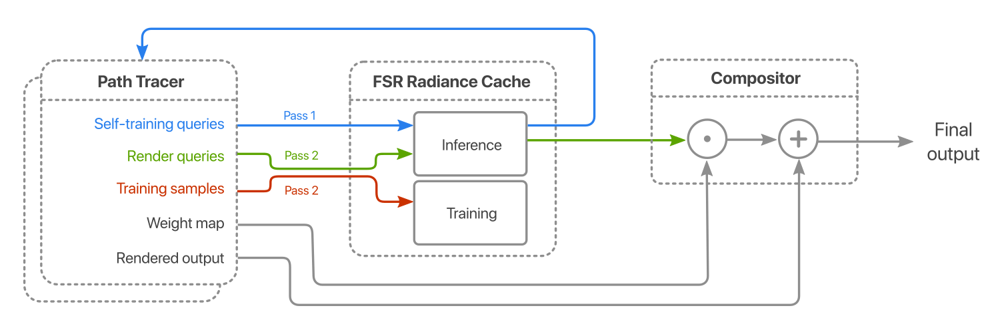

<!-- @page page_techniques_radiance_cache AMD FSR™ Radiance Caching (Preview) -->

<h1>AMD FSR™ Radiance Caching (Preview)</h1>

**AMD FSR™ Radiance Caching** is a next-generation machine learning model that accelerates the computation of dynamic, physically-based lighting in path-traced games.

<strong>⚡ FSR™ Radiance Caching is in technical preview.</strong>  The integration guide and API reference on this page are in active development. Some sections may be incomplete or subject to revision or removal.

## Table of contents

- [Introduction](#introduction)
- [Integration Guide](#integration-guide)
    - [Overview](#overview)
    - [Data layout and packing](#data-layout-and-packing)
    - [Training the Cache](#training-the-cache)
    - [Querying the Cache](#querying-the-cache)
    - [Compositing](#compositing)
    - [Self-Training](#self-training)
    - [Tuning and Optimization](#tuning-and-optimization)
- [Using the API](#using-the-api)
    - [Context Creation](#context-creation)
    - [Command Dispatch](#command-dispatch)
- [Version history](#version-history)

## Introduction

The FSR™ Radiance Cache is a state-of-the-art illumination cache designed to work in tandem with a Monte Carlo path tracer to boost rendering performance and reduce noise. At its core is an online machine learning model that trains continuously to adapt to real-time to dynamic lighting environments. Radiance caching speeds up rendering both by reducing the average depth to which paths are traced, and by sharing information between paths in a manner akin to conventional image denoising.
	
At each frame, a small set of camera paths are traced into the scene and their estimates used to progressively train a neural network. At the same time, the representation stored in the cache is used as a proxy by the path tracer to avoid tracing unnecessary rays. These processes are complementary, with the path tracer providing data to the cache and the cache reducing the workload on the path tracer.

## Shading Language Requirements

- `HLSL`
  - `CS_6_6`

## Integration Guide

The guide provides instructions for integrating the FSR™ Radiance Cache into a real-time rendering pipeline. The presented strategy in the following sections is mirrored in the sample implementation code included with this SDK. It should noted from the outset that there is considerable flexibility in how the the cache can be integrated and optimized within its host renderer. The interested reader is encouraged to consult the References and Further Reading sections for more information.

### Overview

 
<i>Integrating radiance caching into the rendering pipeline. Query and/or training data emitted by the path tracer is passed to the radiance cache for processing by the model. The resulting outputs are combined with the throughput weight map and added to the output. </i>
 

The FSR™ Radiance Cache is invoked via an asynchronous process that interleaves between the path tracing and post-processing passes. The path tracer emits data on which to train together with query data on which to evaluate. These data then dispatched to the SDK via the API. A final compositing step integrates the output from the cache and the path tracer to produce the finished frame.

The following sections explain how training data are generated and enqueued and how radiance queries are evaluated and composited. 

---
### Data Layout and Packing

Data are passed to and from the SDK in four structured buffers containing training inputs and their associated targets, and query inputs and their associated predictions. Two of the buffers are of type `CacheInput` and represent lists of ray/surface intersections. The remaining two buffers are of type `CacheOutput` and represent lists of radiance values. The signatures of both the `CacheInput` and `CacheOutput` structures together with member variables and associated encodings are listed in the table below:

    struct CacheInput
    {
	    float3 position;
	    float2 normal;
	    float2 viewDir;
	    float3 albedo;
	    float  roughness;
    }; 

    struct CacheOutput
    {
	    float3 radiance;
    }; 

| Parameter | Type | Description | Encoding / coordinate space
| - | - | - | - |
| `position`  | float3 | The spatial position of the sample normalized to the scene bounding box | Cartesian form (x,y,z)
| `normal` | float2 | The shading normal at the intersected surface | Polar form (r,φ)
| `viewDir` | float2 | The view direction of the incident ray | Polar form (r,φ)
| `albedo` | float3 | The albedo of the intersected surface | RGB
| `roughness` | float | The roughness value of the intersected surface | Scalar parameter
| `radiance`  | float3 | The reflected radiance along the ray specified by the data in `CacheInput`. | RGB

Inside the shaders, indexing the query and training buffers is done using the sample counters. These are represented as a buffer comprised of two 32-bit unsigned integers whose values are incremented atomically as required by the path tracer. Incrementing the counters assigns the execution thread a unique index in the respective input/output buffer and into which data can then be written. Once the path tracing pass is complete, the counters indicate the occupancy of the structured buffers and which training samples and queries are valid.

Allocation and release of input and output buffers, and counters is the responsibility of the host engine. Handles to each buffer are supplied as parameters to the cache dispatch call via the `ffx::ffxDispatchDescRadianceCache` data structure. (See [Command Dispatch](#command-dispatch).) 

---
### Training the Cache

Training the cache on a continuously varying light field requires sampling the radiance function, _L̂_, at discrete points in world space for each rendered frame. The question of precisely where to place samples in order to maximize cache performance is discussed in more detail later in this guide (see [Tuning and Optimization](#tuning-and-optimization)). In this section, we focus instead on the most straightforward approach whereby samples are seeded from paths traced from the camera.

 
<i>Multiple samples and their associated seed locations x1...3 generated from sub-paths of a single training path</i>

 

Training samples are represented as input/target pairs that describing the statistical correlations between ray/surface intersections and extant radiance leaving the surface. Generating these data involves selecting a subset of pixels on the image plane through which a set of training paths are traced into the scene. Training samples are then seeded at the vertices of each path, starting with the primary ray intersection and traversing downwards to include all sub-paths concluding in the terminating vertex, _xN_. 

The sample input for a given subpath _i_ is comprised of the intersected position, surface normal, view direction, albedo and roughness. The sample target is the estimate of extant radiance  _L̂_  along the view direction. This can be expressed by the following equation:

 

Here, _L̂d_ is the component of illumination evaluated by a next-event estimator (often called the direct component). _f_ is the BSDF weight as an RGB triple, loosely corresponding to the albedo of the intersected surface. The incandescent term is also considered, but omitted here for brevity.
 
An important point to note is the initialization of the product term where _k = i + 1_. The +1 offset means that the albedo at the primary vertex of the sub-path is factorized out. The effectively frees up bandwidth in the model because can no longer "see" the high-frequency texture detail thus does not try to encode it. Undoing the effects of factorization simply requires re-multiplying the prediction by the same factor after the cache is queried. (See [Querying the Cache](#command-dispatch).)

For recursive path tracers, evaluating _L̂_ for a given sub-path _i_ is trivial. For iterative path tracers, the absence of a call stack requires that individual components of _L̂_ be stored and re-integrated to calculate the correct throughput weights and radiance. 

---
### Querying the Cache

Querying the cache follows the same execution flow as training except that a single query is emitted for every pixel in the viewport whose camera ray intersects with the scene geometry. To mask reconstruction errors from the cache, rays are allowed to scatter one or more times before the query is actually emplaced. This scattering (often referred to as "final gathering") helps obfuscate bias from the cache and preserve details such as fine geometric detail, self-shadowing, self-interreflection, and discontinuities in luminosity.

 
<i>Paths that have been sufficiently scattered by the camera ray hit are eligable to query the cache on the next ray intersection (x'1,2). Meanwhile, paths interacting with highly specular BSDFs must be traced further until they encounter a scattering surface (x''1...4)</i>

 

Determining when to stop scattering and terminate the path requires tracking the footprint of the path at it propagates through the scene. The change in footprint between nodes _i_ and _i + 1_ is a function of the length of the path segment <i>||xi+1 - xi||</i> and the solid angle of the scattered ray at <i>xi</i> (equal to the inverse of the sampling probability, _p_, of the BSDF).[1]

Sample code for determining whether a cache input should be constructed and stored and the path terminated is given below:

    const float kRadianceCacheRaySpreadThreshold = 0.01;
    if(ray.depth == 0)
    {
        cameraVertexSpread = pow(ray.tNear, 2) / (1e-10 + kFourPi * -dot(ray.od.d, hit.n));
    }
    else 
    {
        pathSpread += sqrt(pow(ray.tNear, 2) / (1e-10 + ray.pdf * -dot(ray.od.d, hit.n)));
        if(pow(pathSpread, 2) > cameraVertexSpread * kRadianceCacheRaySpreadThreshold)
        {                               
            cachePredInputBuffer[renderCtx.pixelIdx] = ConstructRadianceCacheInput(ray, hit);
            break;
        }
    }

For the complete code, see lines `247—266` in `shaders/scene/Renderer.hlsl`

---
### Compositing

In addition to the cache queries, the path tracer also stores the product of all throughput weights at each intersection up to and including the terminating vertex. Once the neural radiance cache pass has executed, the results are combined with the accumulated output from the path tracer. This is a straightforward element-wise multiply-add operation where each radiance estimate from the cache is multiplied by its associated throughput product before being accumulated into the path traced output. 

---
### Self-Training

 

Self-training is a simple extension that simulates arbitrarily long training paths to by leveraging the cache as its own training proxy. One possible implementation of self-training is as follows:

1. The path tracer is invoked to trace only the set of training paths. At the same time as seeding training data, self-training queries are emplaced at the the terminating vertex of each path. Simultaneously, the product of the throughput weights from the starting vertex of each sample to the terminating vertex of the path are computed and stored.
2. The radiance cache is invoked in query-only mode, returning predictions of extant radiance for the aforementioned self-training queries. The inferred values are then accumulated into the training targets by multiplying them with their associated throughput weights.
3. The path tracer is invoked a second time, enqueueing the full set of queries corresponding to each pixel in the viewport. 
4. The radiance cache is invoked a second time in query + training mode. This populates the prediction buffer with per-pixel radiance estimates and updating the neural network with data from the latest training samples.
5. Finally, the compositing pass is invoked. Each radiance estimate is multiplied by its associated throughput weight before being accumulated into the rendered output from the path tracer.

 

 

### Tuning and Optimization

As an online algorithm, the FSR Radiance Cache represents a departure from contemporary ML-based technologies. Instead of using a pre-trained model, the cache continuously learns from the  of samples emitted by the path tracer. Though this approach allows the cache to respond dynamically to changes in lighting and geometry, it also requires careful tuning so as to maximize performance and minimize unwanted artifacts.

A prominent drawback of using a path tracer for real-time applications is the high levels of residual noise in rendered outputs. Noise manifests spatially as graininess or blotchiness on the image plane, and temporally as flickering, popping or strobing. In training on sparse, stochastic data the radiance cache is particularly susceptible to temporal noise from one or more of the following sources:

- **Estimator variance**, especially high-frequency, high-energy noise, a.k.a. spike noise or "fireflies". This is caused by a relatively small number of samples carrying a disproportionately high amount of energy compared to the rest of the set. 
- **Periodic oscillations** from the model itself. This is generally a result of the optimizer continually overshooting local minima in the turbulent loss landscape. While these kinds of oscillations may be precipitated by Monte Carlo noise, they are further exacerbated by the inherently non-linear training process. The result is temporal flicker at a much broader set of spatial frequencies than would otherwise be seen from estimator noise alone.
- **Damped oscillations** triggered by abrupt changes in lighting and/or camera position. We discuss these scenarios in more detail in the following section.

Fortunately, instabilities of all kinds can be managed effectively, both by improving the condition of the training data and by tuning the hyperparameters exposed via the API. Reduce noise in the training data is the most reliable approach because it fundamentally improves the accuracy of the cache itself. Potential methods of reducing variance are listed below:

- **Importance sampling**. Techniques include spatio-temporal reservoir resampling (ReSTIR) for direct and indirect illumination, path guiding, and bidirectional techniques that improve the likelihood of high-energy paths being found.
- **Surface roughening**. This simple technique artificially roughens the surfaces of training paths at each successive bounce, reducing sample variance at the cost of additional bias. 

In addition to improving the training data, the API exposes two hyperparameters than can be used to adjusted flicker, stability and overall responsiveness. For detailed instructions on how these parameters can be overridden in the dispatch call, see [Command Dispatch](#command-dispatch).

#### Learning Rate

The learning rate controls how fast the optimizer adjusts the model weights with respect to partial differential of the loss function. By default, this value is set to `0.002`. Lower values result in increased stability and less flicker but at the cost of a slower response to changes in illumination and values result in decreased stability and an increased risk of model divergence. 

#### Weight Smoothing

The weight smoothing parameter controls an exponentially moving average applied to the copy of weights that are used to predict radiance values. For a given weight _w_ at training iteration _t_, the moving average <i>w&#773;t</i> is chosen as a blend of the previous average <i>w&#773;t-1</i> and the new value <i>wt</i> using the formula <i>w&#773;t = α w&#773;t-1 + (1 - α) wt</i>. Accordingly, a smoothing value _α = 0_ equates to no averaging while a value of _a = 1_ equates to the weights never being updated.

By default, _α_ is set to 0.99. Larger values result in less flicker at the expense of decreased responsiveness and smaller values result in more flicker with the benefit of increased responsiveness. 

## Using the API

### Context Creation

Creating an instance of the radiance cache is done by calling  `ffx::CreateContext()` and supplying initialization parameters via the `ffxCreateContextDescRadianceCache` structure. The layout of this structure is as follows:

| Member | Type | Description |
| - | - | - |
| `version` | uint32_t |  The requested version, packed with the `FFX_RADIANCECACHE_MAKE_VERSION()` macro. |
| `maxInferenceSampleCount` | uint32_t | The maximum number of inference samples that the cache will process per frame. |
| `maxTrainingSampleCount` | uint32_t |  The maximum number of training samples that the cache will process per frame. |
| `flags`  | uint32_t | A combination of `ffxApiCreateContextRadianceCacheFlags`. |

 The value of `maxInferenceSampleCount` is typically set to the total number of pixels in target viewport (e.g. 2073660 for 1920 x 1080 resolution.) For engines rendering at multiple resolutions, this value should be a function of the maximum viewport resolution for which radiance cache inference is required.

The value of `maxTrainingSampleCount` is independent of viewport resolution, however it is typically set between 1-5% of the total rendered pixel count. Maximum inference and training counts are used internally by the SDK to determine the number of compute dispatches to enqueue per epoch. The number of valid samples that generated by the path tracer must be defined independency on a per-frame basis by the counters passed to `ffxDispatchDescRadianceCache`. (See [Training the Cache](#placement-in-the-frame").)

The value of `flags` must be a combination of `ffxApiCreateContextRadianceCacheFlags`, as defined in the following table:

| Flag | Description |
| - | - |
| `FFX_RADIANCE_CACHE_CONTEXT_TRY_FORCE_WMMA`  | Attempts to force context creation using the high-performance backend. This flag can be used to test whether WMMA support is present on the selected device. If it's not, `ffx::CreateContext()` will fail with error code `ffx::ReturnCode::ErrorParameter` |

### Command Dispatch

All per-frame operations on the radiance cache, including inference, training and resetting, are invoked through a single call to `ffx::Dispatch`. Parameters are supplied by the `ffx::DispatchDescRadianceCache` data structure whose members are defined as follows:

| Member | Type | Description |
| - | - | - |
| `commandList`  | void* | A pointer to an open command list. |
| `predictionInputs`  | FfxApiResource | A handle to a buffer containing prediction input data. |
| `predictionOutputs` | FfxApiResource |  A handle to a buffer that will receive output data from the cache predictions. |
| `trainInputs` | FfxApiResource | A handle to a buffer containing training input data.  |
| `trainTargets` | FfxApiResource | A handle to a buffer containing training target data.  |
| `sampleCounters` | FfxApiResource | A handle to a buffer indicating the number of samples in the prediction and training buffers. |
| `flags` | uint32_t | A combination of `ffxApiDispatchRadianceCacheFlags` |
| `overrides::learningRate` | FfxApiResource | Overrides the learning weight of the model. The flag `FFX_RADIANCE_CACHE_OVERRIDE_LEARNING_RATE` must be specified for this to take effect. |
| `overrides::weightSmoothing` | FfxApiResource | Overrides the smoothing factor applied to the model weights. The flag `FFX_RADIANCE_CACHE_OVERRIDE_WEIGHT_SMOOTHING` must be specified for this to take effect. |

The value of `flags` should be a combination of `ffxApiDispatchRadianceCacheFlags` defined in the following table.

| Flag | Description |
| - | - |
| `FFX_RADIANCE_CACHE_DISPATCH_INFERENCE`  | Dispatches an inference pass. This is always enqueued <i>before</i> a training pass. |
| `FFX_RADIANCE_CACHE_DISPATCH_TRAINING`  | Dispatches a training pass. This is always enqueued <i>after</i> a inference pass. |
| `FFX_RADIANCE_CACHE_CLEAR_INFERENCE_COUNTER`   `FFX_RADIANCE_CACHE_CLEAR_TRAINING_COUNTER`   `FFX_RADIANCE_CACHE_CLEAR_ALL_COUNTERS`  | Signals that the counter defining the number of inference and/or training samples should be cleared <i>after</i> the inference/training passes have completed |
| `FFX_RADIANCE_CACHE_RESET`  | Signals that the cache should be reset to its default start-up parameters (not including the sample counters.) This is always executed <i>before</i> inference/training. |
| `FFX_RADIANCE_CACHE_OVERRIDE_LEARNING_RATE`  | Signals that the default learning rate of 0.002 should be overridden by the value in overrides::learningRate. |
| `FFX_RADIANCE_CACHE_OVERRIDE_WEIGHT_SMOOTHING`  | Signals that the smoothing factor of 0.99 should be overridden by the value in overrides::weightSmoothing. |

<h2>Version history</h2>

| Version        | Date              |
| ---------------|-------------------|
| **0.9.0**      | 10th December 2025     |

Refer to changelog for more detail on versions.
