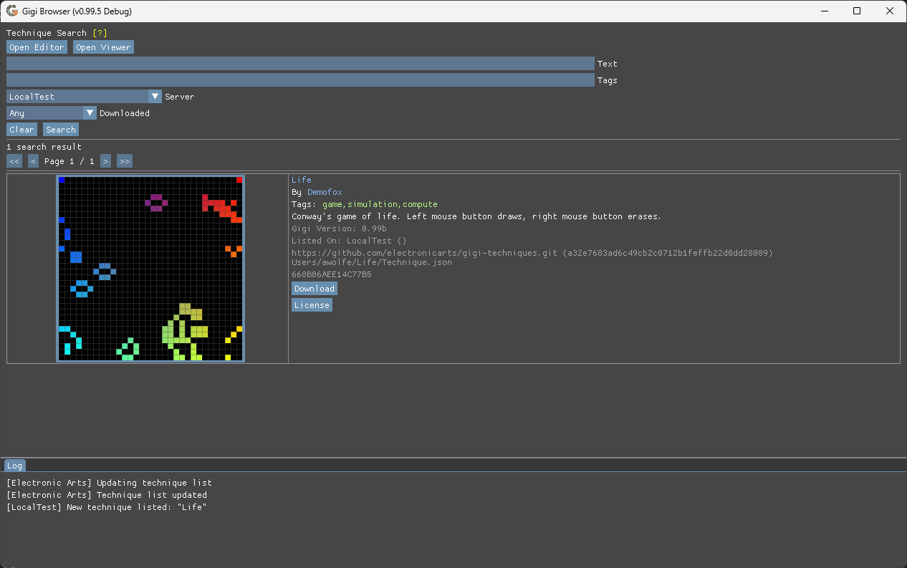

# Sharing Techniques In The Gigi Browser

The technique sharing server lives on github at https://github.com/electronicarts/gigi-techniques/

This repository contains a Techniques.json file that lists the techniques served. Your technique must be added to that file to show up in the browser.

The current technique list json file can be seen here: [Techniques.json](https://github.com/electronicarts/gigi-techniques/blob/main/Techniques.json)

To get your technique added, you can make a merge request to add it yourself.  Alternately, you can open an issue asking for it to be added.

If opening an issue, please provide:

1. The url to the git repository where your technique lives.
1. The path to the details file in that repository.
1. The 40 character SHA-1 commit hash you want shared.

Example:

1. https://github.com/electronicarts/gigi-techniques.git
1. [Users/awolfe/Life/Technique.json](https://github.com/electronicarts/gigi-techniques/blob/main/Users/awolfe/Life/Technique.json)
1. [a32e7683ad6c49cb2c0712b1feffb22d0dd28009](https://github.com/electronicarts/gigi-techniques/commit/a32e7683ad6c49cb2c0712b1feffb22d0dd28009)

## Technique Details File

The details file is a json file describing your technique.  The following fields are required:

1. Title
1. Description
1. Author - Who made it (individual name, multiple names, game team, etc.)
1. Screenshot - A relative path to a screenshot of your technique
1. GigiVersion - What gigi version the technique was made in
1. License - Specifies how your technique may or may not be used.

These fields are optional:
1. Technique - A relative path to the .gg file to open in the editor or viewer
1. Tags - Comma separated list of tags
1. Website - a URL to get more information about the technique, or similar.

An example details json file can be seen here: [Users/awolfe/Life/Technique.json](https://github.com/electronicarts/gigi-techniques/blob/main/Users/awolfe/Life/Technique.json)

When the user downloads your technique, it will download the folder where your details file lives, and all subfolders recursively.

## Testing

Once you have a technique details file in your repo, a screenshot, and all the rest commited to your git repository, you can test it to see how it will look in the browser, before submitting it to a sharing server.

To do so, run GigiBrowser.exe with command line parameters:

GigiBrowser.exe -Technique &lt;repository&gt; &lt;commit&gt; &lt;detailsPath&gt;

As an example:

GigiBrowser.exe -Technique https://github.com/electronicarts/gigi-techniques.git a32e7683ad6c49cb2c0712b1feffb22d0dd28009 Users/awolfe/Life/Technique.json

The technique will show up as the only technique listed by default, under the Server "LocalTest", like the below:

## Submission Guidelines & Acceptance Criteria

These submission guidelines are also the criteria by which we accept or reject submissions, but are subject to change, and subject to the judgement calls of individual moderators.

* The commit field must be a git hash and cannot be a branch name. We review a specific commit.
* To update the hash of a technique or to remove it from the list, a merge request must come from the same repository that the technique is hosted on.
* Please test your technique in the browser using the -Technique command line parameter to make sure everything looks and works like you want it to before submission.
* No violence, profanity, or non G rated text, assets, comments or rendering.
* No executables allowed in downloaded package.
* Your technique should not run excessively slowly on a reasonably modern machine under default parameters.

We will try our best to review your submission in a timely manner, and give an explanation if not accepting it.

Thank you for contributing to the Gigi ecosystem!
