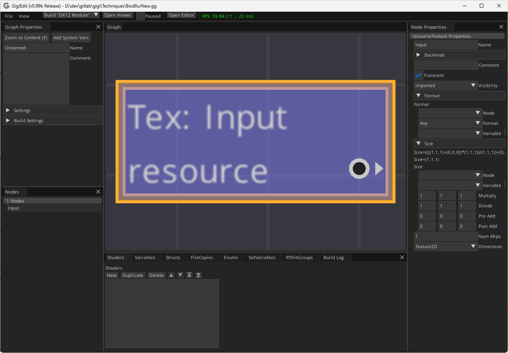
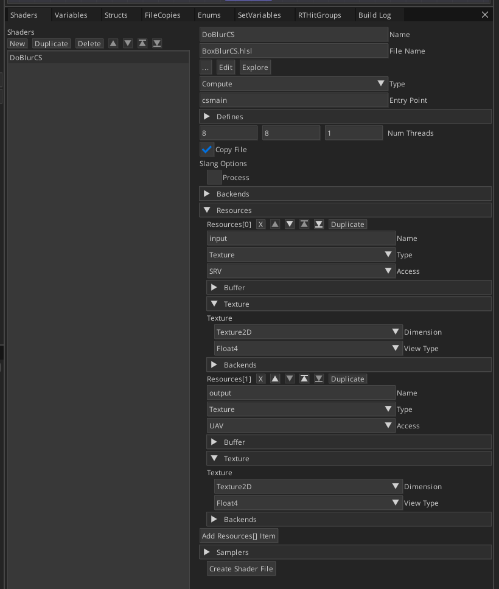
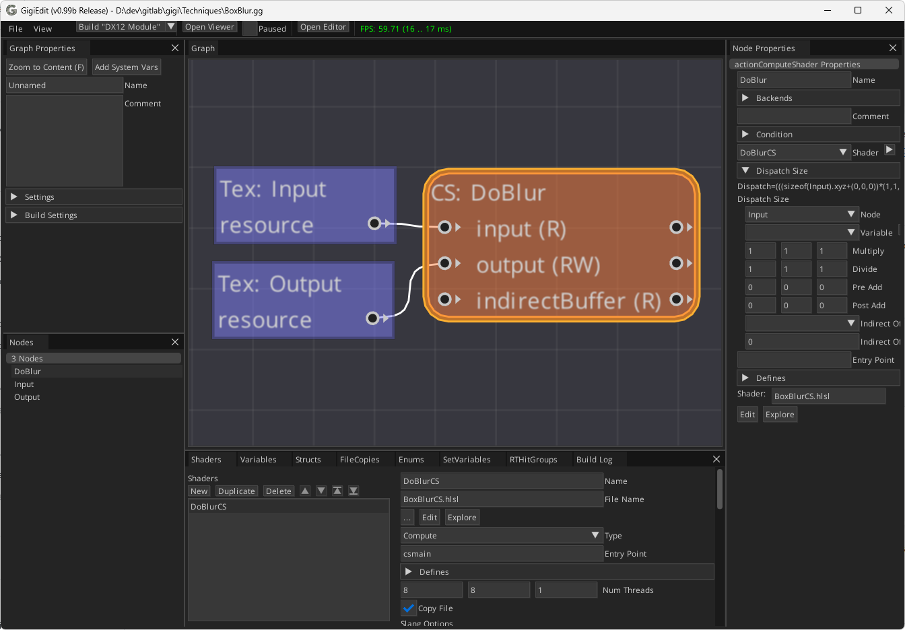
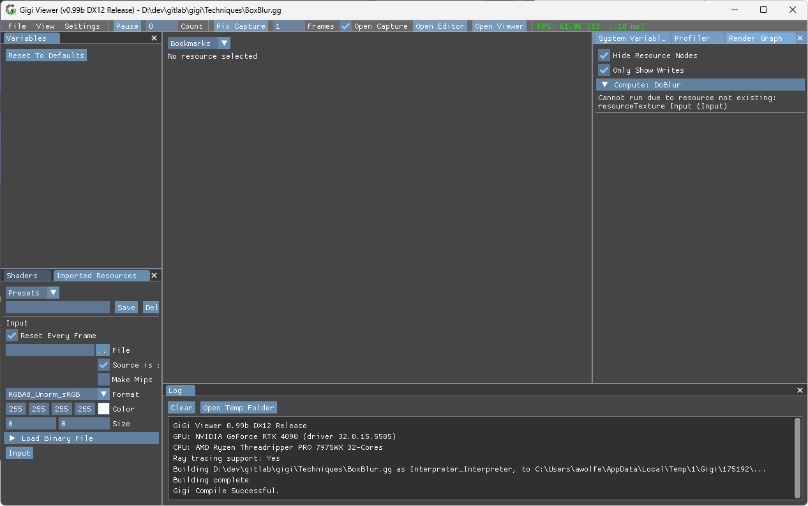
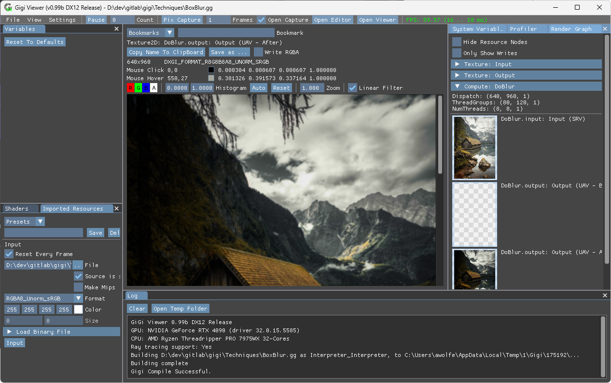
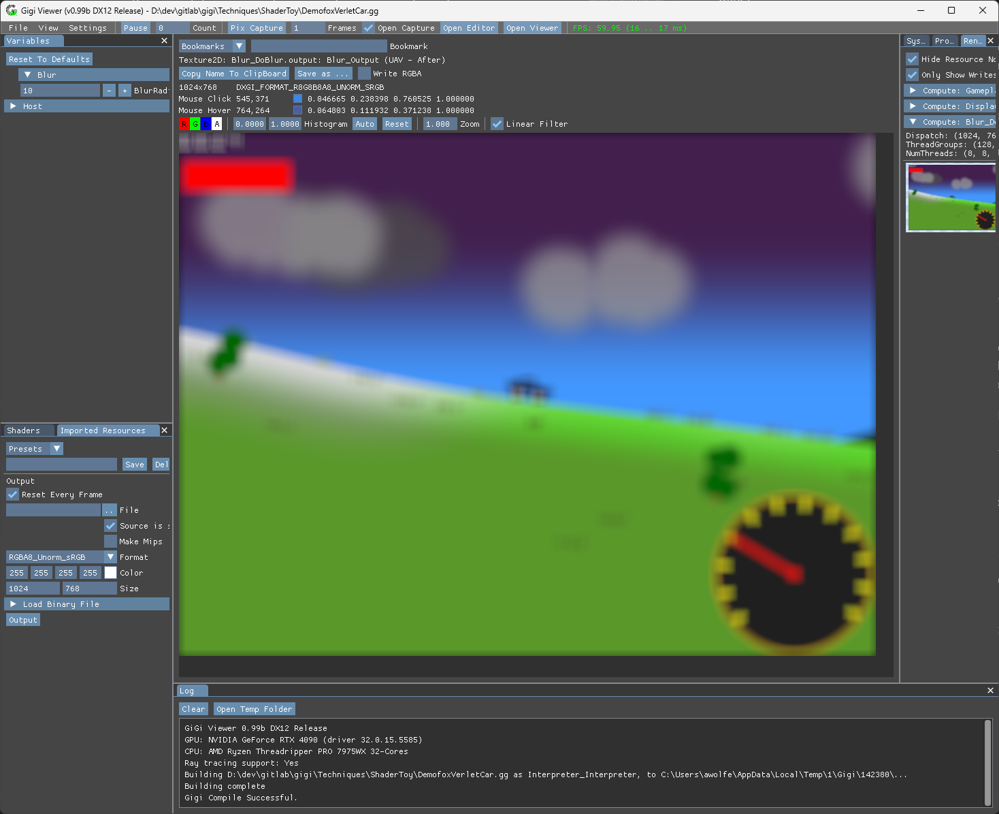

# Gigi Tutorial

Gigi is a rapid prototyping and development platform for real time rendering, developed by SEED.  It's meant for use by professionals, researchers, students, and hobbyists.  We've used Gigi internally for collaboration between teams, we've used it in published research, and we've used it to generate code that we've shared publicly.

By the end of this tutorial, you'll know how to create a box blur post processing technique, and how to apply it to a different technique.  There are many features of Gigi we won't be covering, but this should be enough to get you started.

## Getting Gigi

Note: Gigi is currently windows only.  The editor and compiler would port to other platforms fairly easily, but the viewer is more of a challenge because it has to execute Gigi graphs. It's planned, but not at any specific time.

The source code and binaries for Gigi are available at https://github.com/electronicarts/gigi.

To build from source, clone the repo and build gigi.sln in visual studio.  I use vs2022, but vs2019 worked as well, last I tried.

To use prebuilt binaries, go to the releases tab https://github.com/electronicarts/gigi/releases/.  You can either download the .zip file, and extract that to the location of your choice, or you can download and run the installer exe.


After downloading or building Gigi there are three executables in the root directory:
* **GigiEdit.exe** - This is where you create and modify techniques.
* **GigiViewerDX12.exe** - This lets you run your techniques and is where you profile, debug, and iterate. Supports hot reloading of shader files, asset files, and .gg files. Also python scriptable to automate rendering and GPU tasks.
* **GigiCompiler.exe** - This command line utility generates code for your technique. The code is properly indented, has comments, uses human friendly variable names and is meant to look as if a human wrote it, and pass a reasonable code review.  Currently only DX12 code generation is supported in this public repo.  Privately, we have Frostbite, UE5 and Halcyon code generation support, and plan to have more backends in this public repo as time goes on.

## Built-in Techniques


Gigi comes with several built in techniques inside of the **Techniques/** folder that you can load from the viewer.  Within the **Techniques/UnitTests/** folder are Gigi techniques meant to exercise every piece of functionality Gigi has to offer.  They are a nice place to find examples of how to do things.

The **Techniques/ShaderToy/** folder contains a few shadertoys I made in years past and ported to Gigi.  They include a stylized path tracer you can fly around in, a playable mine sweeper game, and a playable 2d verlet physics car game.  These were made using Gigi, so there is no C++ or scripting languages involved - just nodes in a node graph, and hlsl shader files.

Viewer controls:
* Drag the left mouse to change the camera orientation
* Use the WASD or arrow keys to fly around.
* Q and E also make the camera move vertically up and down respectively.
* Mouse wheel zooms in or out of the texture being shown.

There is also a machine learning demo (real time inference) at **Techniques/machina2023/mnist.gg** where you can draw a number and it runs a neural network to tell you what number it thinks you drew.  That was made as part of SEED's "Machine Learning for Game Developers" blog posts, and video https://www.youtube.com/watch?v=sTAqWRsEiy0, which explains how to do both training and inference. We generated the code for the demo from Gigi and shipped that out at https://github.com/electronicarts/cpp-ml-intro.

<br clear="right"/>

## Making A Box Blur Technique

Run GigiEditor.exe to launch the editor and save the technique in the **Techniques/** folder as **BoxBlur.gg**.

The editor controls in the central grid render  graph area are:
* Drag right mouse button to pan camera.
* Mouse wheeel to zoom in and out
* Press "F" to focus on the selection, or the entire graph if nothing selected.

We are going to make a technique which takes in an input texture, blurs it, and gives the result as an output texture.  First we'll make the textures.

Right click in the center area (that has a grid) to bring up the "Create Node" menu and choose "resourceTexture" to create a new texture.


Click on the node to select it and:
1. Set the name to "Input". Every node needs a unique name to identify it.
2. Set the visibility to "Imported" meaning that this texture comes to us from outside of the technique.

We will leave the rest of the settings alone.  Not setting the format or size is fine for imported textures, and means that it will accept any format or size.



Our input texture is created. To create our output texture, right click on an empty space, and create another "resourceTexture" node. Then:
1. Set the name to "Output"
2. Set the visibility to "Exported" meaning that the texture is managed by the technique, but is made available outside of the technique after execution.
3. Under the "Format" section, set the "Node" drop down to "Input", meaning that this texture will have the same format as "Input", whatever format that is.
4. Under the "Size" section, set the "Node" drop down to "Input", meaning that this texture will be the same size as the "Input" texture.


Now that our textures are created, we need to make a new compute shader to act on them.

In the shaders tab at the bottom of the screen, click "New" to create a new shader. Then:
1. Set the name to "DoBlurCS"
2. Leave the "Type" as compute.
3. Set the "Entry Point" to "csmain"

We then need to specify what resources the shader wants to access. In the "Resources" section:
1. Click "Add Resources[] Item"
2. Name it "input", set the type to "Texture" and set the access to "SRV" which means read only.
3. Add another resource and name it "output", set the type to "Texture" and set the access to "UAV" which means read/write.

Lastly, scroll to the bottom, click "Create Shader File", and name it "BoxBlurCS.hlsl"



Click the edit button to open the shader file in your default shader editor. For me that is VSCode.

In the skeleton shader file that Gigi made for you, you'll notice a couple strange looking tokens.  Before sending your shader to the shader compiler, Gigi processes the shader file for string replacement.

* **/\*$(ShaderResources)\*/** - This is where Gigi will put the declarations of accessed resources (SRVs, UAVs, CBVs) that you declared in the resources section of the shader. The reason Gigi inserts these instead of getting them from the shader by reflection is because different target APIs or engines want resources declared in different ways.  When Gigi inserts them, it's able to generate shader files that work on those platforms.

* **/\*$(_compute:csmain)\*/** - This declares a compute shader entry point named "csmain". Gigi will write out the numthreads declaration and such when doing the string replacement processing.

Next we write the shader, which loops through a 3x3 area for each input pixel, sums up the color, and the count (as weight), divides the color by the weight to make it the average color, and finally writes that averaged color to the output. Enter the code below, save, and go back to the editor.

```c++
// Unnamed technique, shader DoBlurCS
/*$(ShaderResources)*/

/*$(_compute:csmain)*/(uint3 DTid : SV_DispatchThreadID)
{
	int2 px = int2(DTid.xy);
	float3 color = float3(0.0f, 0.0f, 0.0f);
	float weight = 0.0f;
	for (int iy = -1; iy <= 1; ++iy)
	{
		for (int ix = -1; ix <= 1; ++ix)
		{
			color += input[px + int2(ix, iy)].rgb;
			weight += 1.0f;
		}
	}
	color /= weight;
	output[px] = float4(color, 1.0f);
}

/*
Shader Resources:
	Texture input (as SRV)
	Texture output (as UAV)
*/
```

Now that we have our shader written, we need to create a compute shader action node.  In the editor, right click and create an "actionComputeShader" node. Then:

1. Set the name to "DoBlur"
2. In the "Shader" drop down, choose our new shader "DoBlurCS". After this, our resources "input" and "output" will appear as pins.
3. Under the "Dispatch Size" section, set the "Node" drop down to "Input" which means the dispatch will be the size of the "Input" texture.  That will be divided by the "Num Threads" setting on the shader, and rounded up, like you'd expect.
4. Connect the textures to the compute shader.



## Viewing & Iterating on Our Technique

Click the "Open Viewer" button at the top of the editor to open this technique in the viewer.

When we do that, we won't see much of anything.  On the right, under the "Render graph" tab, we can expand the section "Compute: DoBlur" to see that our compute shader says it can't run because the texture "Input" doesn't exist.

We declared that as an imported resource, saying it would come from outside of the technique, and we didn't give it a resource, so it makes sense it would say that resource doesn't exist.



The "Imported Resources" tab in the lower left is where you define imported resources for your technique.

We could set the size and color fields to make a constant color texture, but blurring a constant color texture doesn't make sense.  Click on the "..." button next to "File" and choose **Techniques/cabinsmall.png**.

A small picture should appear under the render graph window now, and you can click it to view it full size.

In the render graph window are also checkboxes to hide resource nodes and only show writes. We can uncheck those to see more of the render graph.  When we do that, we can see that our shader's "input" image is a lot brighter than our "output" image.  You can click back and forth between the input and output and see that it's very hard to tell if we are actually blurring or not, because the brightness changes so much.



The reason for the brightness differences is that we are mixing up sRGB and linear color spaces.

Our input texture is set to have a format RGBA8_Unorm_sRGB which is correct, and the checkbox is checked for "Source is sRGB" which is correct.

In the shader, when we read input, it is converted from sRGB to linear because of that texture format, so we are blurring in linear space, which is correct.

The problem comes in the UAV write. UAV writes don't automatically convert from linear to sRGB, we have to do it ourselves, manually!

So, go back to the editor, and double click the compute shader node to open the shader again, and change the output line to the below.

```cpp
// Unnamed technique, shader DoBlurCS
/*$(ShaderResources)*/

/*$(_compute:csmain)*/(uint3 DTid : SV_DispatchThreadID)
{
	int2 px = int2(DTid.xy);
	float3 color = float3(0.0f, 0.0f, 0.0f);
	float weight = 0.0f;
	for (int iy = -1; iy <= 1; ++iy)
	{
		for (int ix = -1; ix <= 1; ++ix)
		{
			color += input[px + int2(ix, iy)].rgb;
			weight += 1.0f;
		}
	}
	color /= weight;
	output[px] = float4(pow(color, 1.0f / 2.2f), 1.0f);
}

/*
Shader Resources:
	Texture input (as SRV)
	Texture output (as UAV)
*/
```

Taking a color to the power of 1/2.2 is not the highest quality way to convert from linear to sRGB, but it will work for our purposes.

Save the shader file and go back to the viewer, which has since hot reloaded that shader.

Now the output should be much brighter, like the input, and switching between DoBlur.input and DoBlur.output by clicking back and forth, it should be apparent that the blur is working.

## Adding A Blur Radius Parameter To Our Technique

Let's add a parameter that lets us control the size of our blur.  To do this, we are going to need to introduce a new Gigi concept: Variables.

Variables are values owned by the CPU.  They have a type, and they have a default value.  Variables can be used to drive the size of resources, they can be used to control dispatch sizes of shaders, they can be used in logic that controls whether or not nodes run, and they can also be read by shaders.  Furthermore, variables can have conditional logic that executes each frame to set their values to expressions involving other variables.  Variables can also show up as console variables, or in scripting interfaces, or in UI, depending on the capabilities of the target platform.

To add a blur radius parameter to our technique, we are going to go back to the editor, and under the Variables tab, click "New" to create a new variable.  Then:
1. Name it "BlurRadius"
2. Set the type to "Int"
3. Set Dflt to 1.  (This sets the default value)
4. Set the visibility to "User"
5. Save


The visibility setting of a variable defines who or what can read and write the value.  "Internal" means only the technique can read or write the variable.  "Host" means that the host application running the technique can also modify the variable.  "User" means that the variable should show up in the UI, script interface, console variables, or similar, as available on the target platform.

To read this variable from the shader, we use the token **/\*$(Variable:BlurRadius)\*/**.  So, double click the compute shader node, and change the for loops from looping between +/-1, to +/- BlurRadius like this:

```c++
// Unnamed technique, shader DoBlurCS
/*$(ShaderResources)*/

/*$(_compute:csmain)*/(uint3 DTid : SV_DispatchThreadID)
{
	static const int c_blurRadius = /*$(Variable:BlurRadius)*/;

	int2 px = int2(DTid.xy);
	float3 color = float3(0.0f, 0.0f, 0.0f);
	float weight = 0.0f;
	for (int iy = -c_blurRadius; iy <= c_blurRadius; ++iy)
	{
		for (int ix = -c_blurRadius; ix <= c_blurRadius; ++ix)
		{
			color += input[px + int2(ix, iy)].rgb;
			weight += 1.0f;
		}
	}
	color /= weight;
	output[px] = float4(pow(color, 1.0f / 2.2f), 1.0f);
}

/*
Shader Resources:
	Texture input (as SRV)
	Texture output (as UAV)
*/
```

Now we can go back to the viewer and we are greeted with a "BlurRadius" field in the Variables tab in the upper left.  You can increase it to increase the blur or decrease it to decrease the blur, or even set it to 0 to make it not blur at all.  I set it to 20 for this screenshot.


If you are wondering how the variables get into the shaders, the answer is constant buffers.  When Gigi is processing shaders for string replacement, it scans for variable usage, and will make / hook up constant buffers to your shaders to send them all in.

Let's see this in action. click the "Shaders" tab and you'll see two groups of shaders: the "Shaders", which are the source shaders we've been editing, and the "Processed Shaders" which are the shaders as they are sent to the shader compiler.  Click on "DoBlurCS" in the "Processed Shaders" section to see the processed shader like below.  You can see the input and output textures, and the constant buffer going into the shader.

```c++
// Unnamed technique, shader DoBlurCS


struct Struct__DoBlurCSCB
{
    int BlurRadius;
    float3 _padding0;
};

Texture2D<float4> input : register(t0);
RWTexture2D<float4> output : register(u0);
ConstantBuffer<Struct__DoBlurCSCB> _DoBlurCSCB : register(b0);

#line 2


[numthreads(8, 8, 1)]
#line 4
void csmain(uint3 DTid : SV_DispatchThreadID)
{
	static const int c_blurRadius = _DoBlurCSCB.BlurRadius;

	int2 px = int2(DTid.xy);
	float3 color = float3(0.0f, 0.0f, 0.0f);
	float weight = 0.0f;
	for (int iy = -c_blurRadius; iy <= c_blurRadius; ++iy)
	{
		for (int ix = -c_blurRadius; ix <= c_blurRadius; ++ix)
		{
			color += input[px + int2(ix, iy)].rgb;
			weight += 1.0f;
		}
	}
	color /= weight;
	output[px] = float4(pow(color, 1.0f / 2.2f), 1.0f);
}

/*
Shader Resources:
	Texture input (as SRV)
	Texture output (as UAV)
*/
```

Since we are looking at this, go back to the editor, and check the "const" box for the BlurRadius variable we created earlier.  Making it const means that it can't be changed at runtime, but can only be changed in the editor.  Save and go back to the processed shader file to see that the variable read is now just setting the variable to a literal and the constant buffer is gone.

```c++
// Unnamed technique, shader DoBlurCS


Texture2D<float4> input : register(t0);
RWTexture2D<float4> output : register(u0);

#line 2


[numthreads(8, 8, 1)]
#line 4
void csmain(uint3 DTid : SV_DispatchThreadID)
{
	static const int c_blurRadius = (1);

	int2 px = int2(DTid.xy);
	float3 color = float3(0.0f, 0.0f, 0.0f);
	float weight = 0.0f;
	for (int iy = -c_blurRadius; iy <= c_blurRadius; ++iy)
	{
		for (int ix = -c_blurRadius; ix <= c_blurRadius; ++ix)
		{
			color += input[px + int2(ix, iy)].rgb;
			weight += 1.0f;
		}
	}
	color /= weight;
	output[px] = float4(pow(color, 1.0f / 2.2f), 1.0f);
}

/*
Shader Resources:
	Texture input (as SRV)
	Texture output (as UAV)
*/
```

Make sure and set it back to non const and save before continuing with the rest of the tutorial.

Being able to set a variable as constant like this is good for when you want to be able to tweak a value during development time, but at runtime, you want the cost of a dynamic choice to go away.  Also useful for masking out debug operations.

Similarly to reading variables in shaders, you can also specify the file name of an image to read in a shader, and Gigi will load it, and pass it to your shader, like this: **/\*$(Image2D:../Textures/splitsum.png:RGBA8_UNorm:float4:false)\*/**.  This feature is useful with noise textures, VFX textures, and similar. Please see **UserDocumentation/GigiShaders_Documentation.docx** for more information about tokens available in shaders.

## Using Our Technique In Another Technique

Now that we have a modular blur technique, we can use it in another technique.  Close the viewer, and in the editor, open **Techniques/ShaderToy/DemofoxVerletCar.gg**.

To the right of the "CS: Display" node, right click and create an "actionSubGraph" node. Then:
1. Name it "Blur"
2. Under "File Name", click "..." and choose the technique we just made **Techniques/BoxBlur.gg**.
3. Plug Display's output pin into Blur's input pin.
4. Save and click "Open Viewer".
5. In the render graph tab, expand "Compute: Blur_DoBlur" and click on the output image.
6. In the variables tab, expand the "Blur" section and change the BlurRadius to 10.
7. Play the game!



When we used our blur technique as a subgraph in the vert physics car game, it was able to expose our imported and exported resources as pins on the subgraph node.  It also brought in any parameters (variables) the technique exposed.  This allowed it to "just work".

When you generate code for a Gigi technique, it inlines any subgraph nodes, recursively, and optimizes it together as a single technique.  Subgraph nodes also allow you to specify a loop count, and a loop index variable, to run a subgraph multiple times in a loop.  The loop count can only be specified as a literal value at the moment (not yet as a variable), so the subgraph loops are also unrolled before they are inlined.

It's also worth noting that subgraph nodes let you do variable replacement.  This lets you replace a variable inside of a subgraph, with a variable from the parent graph.  If you were to call the same subgraph multiple times, but you wanted the same settings for each time you called it, you could have the setting variables in the parent graph, and replace the subgraph variables with the parent graph variables in each sub graph node.  Variable replacement also allows you to change the visibility of subgraph variables, or to replace variables with const variables, or vice versa.

## Running Python in the Viewer

Python scripts can be run from the viewer which can be very handy for automating tedious rendering tasks.

We've used the python interface in published research to gather images for diagrams, and for calculating RMSE graphs for numerical integration.

The viewer unit tests also use the python interface.  You can run it by **File->Run Python Script** and choosing **Techniques/UnitTests/RunTests.py**.  The unit tests load up .gg files, set parameters, trigger technique executions, and then do GPU readback to verify that the output of the technique matches the "gold images" on disk, byte for byte.

It's important to note that Gigi is deterministic by default, and that you have to go out of your way to introduce non determinism - like by passing frame time into the technique through a variable, or by writing shaders in such a way that order of execution is not defined, but impacts the results.  The determinism is useful in tests, and also in **exactly replicating results of experiments quickly and easily**.

For more details about the python interface, see **UserDocumentation/GigiViewerDX12_Documentation.docx**.

## Closing

There are a lot of features not covered by this tutorial, but hopefully this is enough to get you started.  For examples of how to do things not covered here, please see the **Techniques/UnitTests/** folders.

Thanks for reading, and we look forward to seeing what you create!
