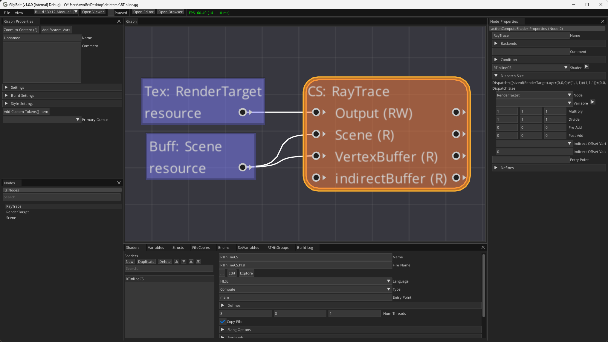

# Ray Tracing Inline

This tutorial shows how to do ray queries from a compute shader. This is known as "inline ray tracing" because the ray tracing happens in line with the rest of the shader.  This contrasts the ray generation shader interface, where you specify ray generation shaders, closest hit shaders, miss shaders, and others.  Inline ray tracing is less powerful, but it is also quicker to set up and simpler conceptually.

First, open the Gigi editor and save the file as RTInline.gg.

## Table of contents
1. [Create A Render Target](#create-a-render-target)
2. [Create Scene Resource](#create-scene-resource)
3. [Create Ray Tracing Compute Shader](#create-ray-tracing-compute-shader)
4. [Authoring The Shader](#authoring-the-shader)
5. [Viewing The Result](#viewing-the-result)

## Create A Render Target

We need a texture to render to, which will show the results of our work.  To make one, right click in the node editing region of the editor and create a new ***Texture*** node.


In the node properties on the right side of the editor, and we can give the texture the name "RenderTarget", we can set the format to RGBA8_Unorm_sRGB and the size to 1280x720.


## Create Scene Resource

We are going to need a 3d object to render onto the render target.  We'll call this 3d object the scene, even though a scene is usually made up of multiple objects.

This 3d object will come into our technique as a buffer, where each entry of the buffer is the information for a single vertex. Right click in the editor, create a ***Buffer*** node and call it "Scene".

This scene will be set in the viewer, so we need to set the ***Visibility*** to ***Internal*** and we will leave the format and count at the default since those will also be set in the viewer.


Note: We will be raytracing against an imported resource, which will be a .obj file loaded from disk, but alternately, you could leave this buffer internal, give this buffer a size and a format, and write to the buffer from a compute shader, doing raytracing against dynamic geometry calculated every frame.

We'll want to read specific fields from our vertex data when our ray hits a triangle, so we will need to define a structure that describes the data we want.  To do this, open the ***Structs*** tab and make a new struct named "VertexBuffer". The struct should have two fields: A float3 Position and a float3 Normal.  To make sure Gigi gives us the values we want for these fields, we need to set the "Semantic" drop down as appropriate.


Note: Gigi will calculate normals and tangents for you if they are not present in your mesh loaded from disk, so long as your mesh has UV coordinates.

## Create Ray Tracing Compute Shader

Next we need to create the compute shader that we are going to be doing raytracing in.

Create a new shader in the shaders tab named "RTInlineCS" with an entry point of "main".  The shader needs the following three resources:
1. UAV (read/write) access to a texture we'll call "Output".  This is where we will put our rendering output.
2. RTScene (raytracing) access to a buffer we'll call "Scene", which we will specify will have a ***Type Struct*** of "VertexBuffer".  This is what we will ray trace against and is going to be an opaque BVH.
3. SRV (read only) access to a buffer we'll call "VertexBuffer", which will also have a ***Type Struct*** of "VertexBuffer". This is the vertex data that we can read from.


At the bottom, click the ***Create Shader File*** button and save it next to the .gg file, calling it "RTInlineCS.hlsl"

Before we start writing the shader, we are going to need a couple variables to do ray tracing.  We are going to need to know the camera position since that is where our rays are going to start from, and we are going to need to know the inverse view projection matrix of the camera to be able to calculate the direction that the rays should shoot in.

We are going to need to define variables that hold these values, so we can read them from the shader.

Under the ***Variables*** tab, create two new variables, leaving their ***Visibility*** as ***Internal*** since the user will never interact with them:

1. float3 CameraPos
2. float4x4 InvViewProjMtx


Before writing our shader, let's hook it up to the graph.

Right click in the node section and create a compute shader node. Name this node "RayTrace", set the shader to the shader we just created "RTInlineCS" and set the dispatch size to "RenderTarget".  Plug the "RenderTarget" texture node into the "Output" pin, and plug the "Scene" buffer node into the "Scene" pin.



The only thing left to do is actually write the compute shader!

## Authoring The Shader

Inline ray tracing requires shader model 6.5, so on the left side of the editor, under ***Settings*** and ***DX 12***, set the ***Shader Model Cs*** to "cs_6_5".


To edit the shader you can double click the orange compute shader node "RayTrace" and it will open the shader in your default shader editor.

The shader is below, with comments to explain each section

```hlsl
// Unnamed technique, shader RTInlineCS
/*$(ShaderResources)*/

// A function to convert from linear color to sRGB color. Needed because our render target is an sRGB format.
float3 LinearToSRGB(float3 linearCol)
{
    float3 sRGBLo = linearCol * 12.92;
    float3 sRGBHi = (pow(abs(linearCol), float3(1.0 / 2.4, 1.0 / 2.4, 1.0 / 2.4)) * 1.055) - 0.055;
    float3 sRGB;
    sRGB.r = linearCol.r <= 0.0031308 ? sRGBLo.r : sRGBHi.r;
    sRGB.g = linearCol.g <= 0.0031308 ? sRGBLo.g : sRGBHi.g;
    sRGB.b = linearCol.b <= 0.0031308 ? sRGBLo.b : sRGBHi.b;
    return sRGB;
}

/*$(_compute:main)*/(uint3 DTid : SV_DispatchThreadID)
{
    // Get the dimensions of the render target, so we know what percentage of the screen in X and Y this pixel is at.
    uint2 px = DTid.xy;
    uint w, h;
    Output.GetDimensions(w, h);
    float2 dimensions = float2(w, h);

    // Calculate this pixel's location in screen space
    float2 screenPos = (float2(px) + 0.5f) / dimensions * 2.0 - 1.0;
    screenPos.y = -screenPos.y;

    // Calculate this pixel in world space at a specific depth away from the camera.
    // This gives us the target to shoot the ray at.
    float4 world = mul(float4(screenPos, 0.99f, 1), /*$(Variable:InvViewProjMtx)*/);
    world.xyz /= world.w;

    // Describe the ray to shoot
    RayDesc ray;
    ray.Origin = /*$(Variable:CameraPos)*/;
    ray.TMin = 0;
    ray.TMax = 10000.0f;
    ray.Direction = normalize(world.xyz - ray.Origin);

    // Do a ray query to see if the ray hit anything
    RayQuery<RAY_FLAG_CULL_NON_OPAQUE |
             RAY_FLAG_SKIP_PROCEDURAL_PRIMITIVES |
             RAY_FLAG_ACCEPT_FIRST_HIT_AND_END_SEARCH |
             RAY_FLAG_CULL_BACK_FACING_TRIANGLES> rayQuery;

    rayQuery.TraceRayInline(
        Scene,
        0,
        255,
        ray
    );

    rayQuery.Proceed();

    // If we hit a triangle, show the normal
    if (rayQuery.CommittedStatus() == COMMITTED_TRIANGLE_HIT)
    {
        // Get the barycentric coordinates of where the ray intersected the triangle
        float3 barycentrics;
        barycentrics.yz = rayQuery.CommittedTriangleBarycentrics();
        barycentrics.x = 1.0f - (barycentrics.y + barycentrics.z);

        // Get the normals for each vertex in the triangle we hit
        float3 normal0 = VertexBuffer[rayQuery.CommittedPrimitiveIndex() * 3 + 0].Normal;
        float3 normal1 = VertexBuffer[rayQuery.CommittedPrimitiveIndex() * 3 + 1].Normal;
        float3 normal2 = VertexBuffer[rayQuery.CommittedPrimitiveIndex() * 3 + 2].Normal;

        // Calculate the normal interpolated across the triangle at that point and normalize it
        float3 normal = normalize(normal0) * barycentrics.x +
                        normalize(normal1) * barycentrics.y +
                        normalize(normal2) * barycentrics.z;
        normal = normalize(normal);

        // write the normal out as an RGB color between 0 and 1, instead of between -1 and 1.
        Output[px] = float4(LinearToSRGB(normal * 0.5f + 0.5f), 1.0f);
    }
    // Else we missed, show dark grey.
    else
    {
        Output[px] = float4(LinearToSRGB(float3(0.2f, 0.2f, 0.2f)), 1.0f);
    }
}

/*
Shader Resources:
    Texture Output (as UAV)
    Buffer Scene (as RTScene)
    Buffer VertexBuffer (as SRV)
*/
```

## Viewing The Result

Now we can click "Open Viewer" to open the viewer.  We won't see anything because we need to configure some things.

In the lower left of the viewer, we need to configure the ***Imported Resource*** "Scene".  Set the ***Struct*** to "Vertex Buffer" and for File, you can choose a .obj file, or .fbx, or other types.  I am using the stanford bunny obj file from [McGuire Computer Graphics Archive](https://casual-effects.com/data/).

On the right in the render graph, you can open up the "Compute: RayTrace" tab and click on the output to view it.  It's likely too big by default so you can click the "Fit" button to make it fit the window.

.

Things aren't quite right yet though.  Go into the ***System Variables*** tab, scroll down to ***Proj Mtx Texture*** and select "RenderTarget".  That will fix the aspect ratio so the bunny isn't stretched horizontally.

This system variables tab is where you describe your camera, adjust mouse sensitivity and camera fly speed, but this is also where you choose which variables should receive values, such as the camera position or inverse view projection matrix.

When we made the variables to hold those camera values, we named them the same as the default variable names shown here in this window, so we didn't have to do any extra steps to hook them up.  If we had called those variables different names, this is where we would have to specify that those variables should receive those values.

Our works is finished though and we are doing inline raytracing against a BVH from within a compute shader!

Left drag changes the camera direction, and the WASD keys move the camera around.

.