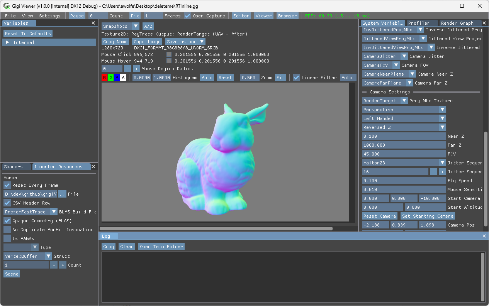

# Gigi Tutorials

| |  |
|:-----|:------|
|  | **Introduction** Make a box blur post processing effect using compute shaders and apply it to another technique.  [Text Version](../tutorial/tutorial.md)  [25 minute Video](https://www.youtube.com/watch?v=qknK-tahICE) |
|  | **Ray Tracing Inline** See how to do inline raytracing, which allows you to do ray queries from compute shaders, and other shader types. The simpler ray tracing option that is quicker to set up, compared to using ray gen shaders.  [Text Version](RayTracingInline/readme.md) |
